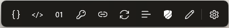
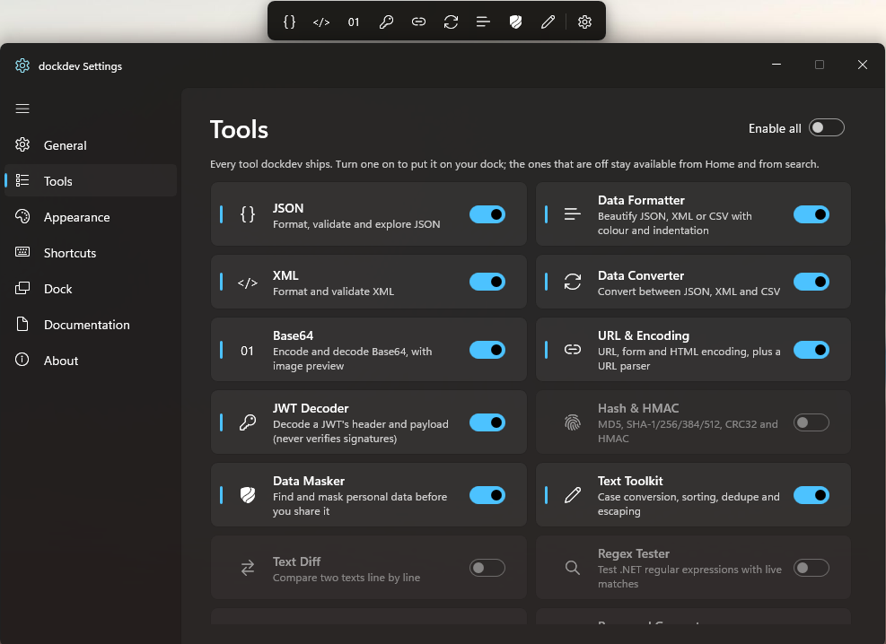
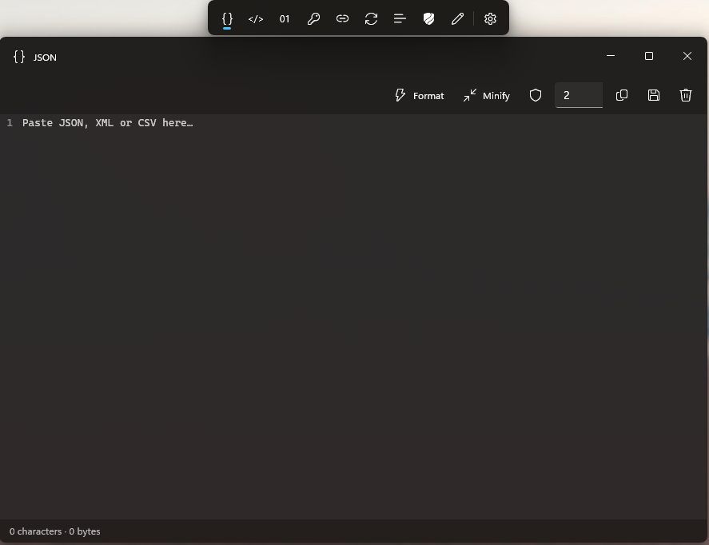
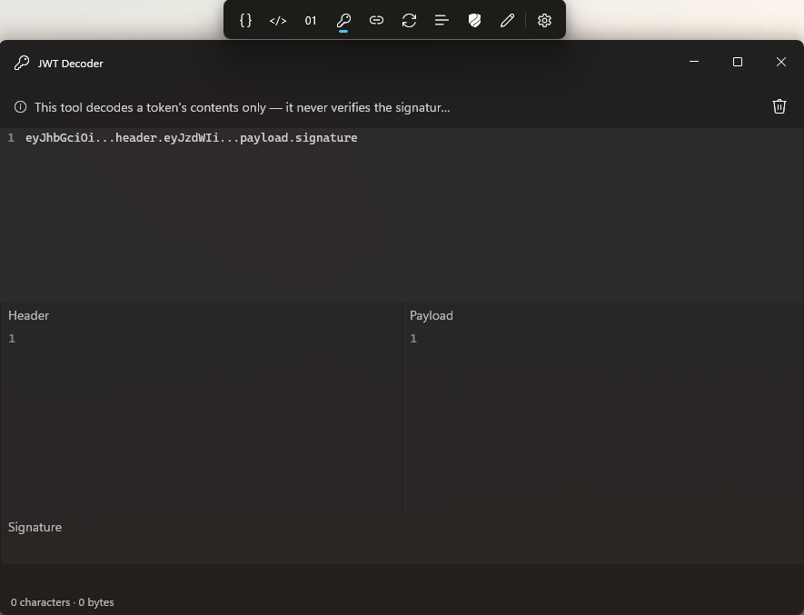
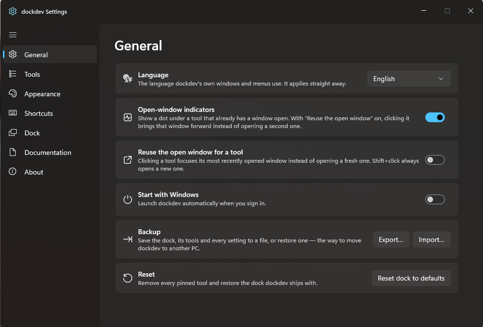

# dockdev

A floating dock of developer tools for Windows, built with WinUI 3. Format JSON, decode a JWT, hash
a file, mask personal data before you paste it into a ticket — without leaving your desktop and
without anything you paste leaving your PC.

**Everything runs locally.** No account, no telemetry, no analytics, and no network connection at
all unless you switch on the optional update check. See [the privacy policy](docs/privacy-policy.md).

---

## The tools

| | |
|---|---|
| **Format & convert** | JSON · XML · Data Formatter · Data Converter (JSON ⇄ XML ⇄ CSV) |
| **Encode & decode** | Base64 (with image preview) · URL & Encoding · JWT Decoder · Hash & HMAC |
| **Privacy** | Data Masker — finds and masks emails, cards, national IDs, secrets and more |
| **Text** | Text Toolkit · Text Diff · Regex Tester |
| **Generate** | UUID · Password · Lorem Ipsum |
| **Numbers & time** | Number Base · Timestamp Converter · Cron Parser · Colour Converter |

Every tool is reachable three ways: from the dock, from quick-launch search, or by dropping a file
on the dock — which routes it to the tool that handles that extension.

## Screenshots

**The dock**



**Tools settings — pick what shows on the dock**



**JSON**



**JWT Decoder**



**General settings**



## Install

**Portable ZIP** — download the latest release, unzip anywhere, run `dockdev.exe`. Self-contained: no
.NET or Windows App Runtime install needed. Settings live in `%AppData%\dockdev`.

**Microsoft Store** — see [docs/store-submission.md](docs/store-submission.md).

Windows 10 1809 (17763) or later; Windows 11 for the Mica and acrylic treatments. x64 and ARM64
builds are published for each release.

## Build from source

Requires the .NET 10 SDK and the Windows 10 SDK build tools. WinUI cannot build AnyCPU, so every
build names an architecture.

```powershell
dotnet build src/dockdev/dockdev.csproj -p:Platform=x64      # or ARM64
dotnet test  tests/dockdev.Tests/dockdev.Tests.csproj -p:Platform=x64
```

Packaging:

```powershell
./scripts/package-release.ps1        # portable ZIPs + SHA256SUMS.txt, optionally signed
./scripts/package-store.ps1          # verified MSIX bundle for the Store
./scripts/run-ui-tests.ps1           # FlaUI smoke tests; needs an interactive desktop
```

## Repository layout

```
src/dockdev/            The app: shell (dock, tray, hotkeys, settings), tools, services
  Services/           Pure, UI-free logic — formats, tokenizers, masking, the tool engines
  ToolPages/          One page per tool, hosted by ToolWindows/ToolWindowBase
  Controls/           CodeView, CodeEditor, DiffView, StructureTree, ToolStatusBar
tests/dockdev.Tests/    xUnit; runs anywhere, no desktop required
tests/dockdev.UITests/  FlaUI; opt-in, needs a real desktop (DOCKDEV_UITESTS=1)
docs/                 Design document, privacy policy, Store submission checklist
scripts/              Packaging and test-run scripts
```

The layering rule that makes the test suite cheap: **services are pure and UI-free**. Nearly every
algorithm in the app is testable with no window on screen.

## Security posture

The attack surface of a tool whose job is parsing text pasted from anywhere is that text, and the
design document's §21 is written accordingly. The rules that are enforced by tests rather than by
convention, because they are the kind that silently rot:

- **XXE and entity expansion** — every XML reader prohibits DTDs entirely.
- **ReDoS** — every regex carries an explicit match timeout, checked reflectively across the whole
  app assembly.
- **Size ceilings** — decided from a file's metadata before it is read; past the ceiling is a
  message, never an out-of-memory.
- **No unmediated network** — no component may construct an `HttpClient`; a source scan fails the
  build if one tries.
- **CSV formula injection** — neutralised on export, including the tab and CR prefixes that a
  four-character guard misses.
- **Nothing from the network reaches the shell** — the one URL the update check reports is
  constrained to an https github.com page before it can be clicked.

Full detail in [the design document](docs/dockdev-design-document.md).

## License

MIT — see [LICENSE](LICENSE).
