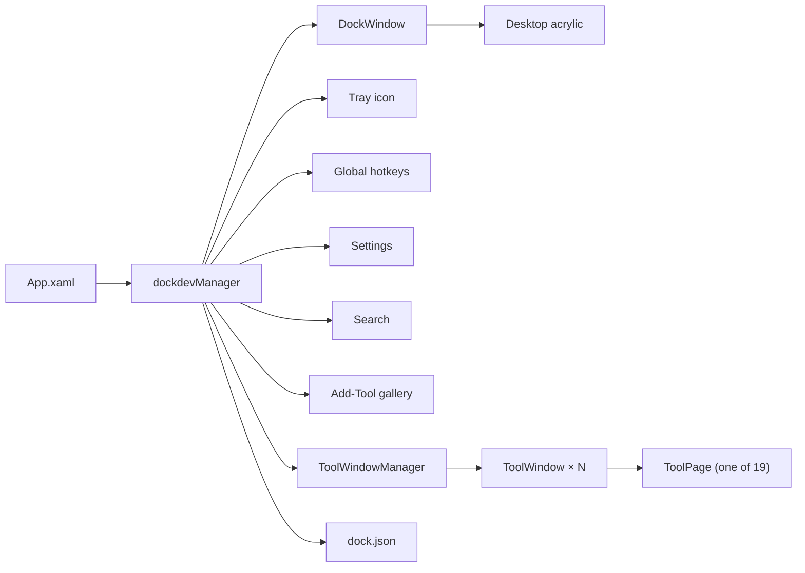

<div align="center">


# dockdev

**Paste it. Fix it. Nothing leaves your PC.**

A native **WinUI 3** floating dock of offline developer tools for Windows.
Format JSON, decode a JWT, hash a file, mask personal data before it goes in a ticket — reachable
from the dock, from quick-launch search, or by dropping a file straight onto it. Nineteen tools,
one dock, always at hand.

**Everything runs locally. No accounts, no telemetry, no analytics, no ads.** No network
connection at all unless you switch on the optional update check.

<p>
  <a href="https://github.com/framedparadox/dockdev/releases/latest"><strong>Download the latest zip</strong></a>
  &nbsp;·&nbsp;
  <a href="#install">Install</a>
  &nbsp;·&nbsp;
  <a href="#the-tools">The tools</a>
  &nbsp;·&nbsp;
  <a href="CHANGELOG.md">What's new</a>
  &nbsp;·&nbsp;
  <a href="docs/privacy-policy.md">Privacy</a>
  &nbsp;·&nbsp;
  <a href="https://github.com/framedparadox/dockdev/issues">Issues</a>
</p>

[](https://github.com/framedparadox/dockdev/releases/latest)
[](LICENSE)
[](#requirements)
[](#requirements)
[](https://github.com/framedparadox/dockdev/actions)
[](#features)

English · Deutsch · Español · Français · हिन्दी · 日本語 · Português (Brasil) · 简体中文

<br>


</div>

<table>
<tr>
<td align="center" width="25%"><strong>Nothing you paste leaves the PC</strong><br><sub>No accounts, no telemetry, no analytics, no ads — parsing happens in-process, offline.</sub></td>
<td align="center" width="25%"><strong>One dock, nineteen tools</strong><br><sub>Format & convert, encode & decode, mask PII, diff, generate — every tool a click away.</sub></td>
<td align="center" width="25%"><strong>Built to never crash or hang</strong><br><sub>Depth-capped parsers, size ceilings, regex timeouts, a process that outlives its windows.</sub></td>
<td align="center" width="25%"><strong>Drop a file, get the right tool</strong><br><sub>Drop on the dock and dockdev opens the tool that matches the extension — or search for it.</sub></td>
</tr>
</table>

---

## Why a local dock instead of a website?

Every one of these tools already exists as a website. The problem is what you're pasting into it.

| | A random web tool | dockdev |
|---|---|---|
| Where your paste goes | Uploaded to a server you don't control | Never leaves the process on your PC |
| Works offline | No | Yes — everything is local |
| Tracking / ads | Often | None — no telemetry, no accounts, no analytics |
| Reach it | Open a browser, remember which site, retype the URL | One click from the dock, quick-launch search, or drop a file on it |
| Handles a huge or hostile input | Sometimes hangs the tab or the browser | Depth-capped, size-ceilinged, regex-timeout'd by design (see [Security notes](#security-notes)) |
| Cost | Sometimes paywalled or rate-limited | Free, no account, MIT-licensed |

Free and open source (MIT). The only thing dockdev can be told to send over the network is a
version check against GitHub — off by default, see [Privacy & data](#privacy--data).

---

## Table of contents

- [Gallery](#gallery)
- [The tools](#the-tools)
- [Features](#features)
- [Install](#install)
- [Requirements](#requirements)
- [Build & run](#build--run)
- [Tests](#tests)
- [Using it](#using-it)
- [Run / debug in VS Code](#run--debug-in-vs-code)
- [Configuration](#configuration)
- [Privacy & data](#privacy--data)
- [Security notes](#security-notes)
- [Troubleshooting](#troubleshooting)
- [Architecture](#architecture)
- [FAQ](#faq)
- [Known limitations](#known-limitations)
- [Roadmap](#roadmap)
- [Contributing](#contributing)
- [Credits & support](#credits--support)
- [License](#license)

---

## Gallery

**Tools settings — pick what shows on the dock**, and **General settings**:

| Tools | General |
|---|---|
|  |  |

**JSON**, and **JWT Decoder**:

| JSON | JWT Decoder |
|---|---|
|  |  |

---

## The tools

Seven of the nineteen show on the dock the first time it runs (chosen for breadth across
categories); the rest are one search or one visit to Settings ▸ Tools away.

| | |
|---|---|
| **Format & convert** | JSON · XML · Data Formatter (auto-detects JSON/XML/CSV) · Data Converter (JSON ⇄ XML ⇄ CSV) |
| **Encode & decode** | Base64 (with image preview) · URL & HTML encoding · JWT Decoder · Hash & HMAC (MD5/SHA/CRC32) |
| **Privacy** | Data Masker — finds and masks emails, phone/contact info, payment cards, national IDs, IP/MAC addresses, coordinates, and secrets/API keys |
| **Text** | Text Toolkit (case, slugify, dedupe, sort) · Text Diff · Regex Tester |
| **Generate** | UUID · Password · Lorem Ipsum |
| **Numbers & time** | Number Base (hex/binary/octal) · Timestamp Converter · Cron Parser · Colour Converter |

Every tool is reachable three ways: from the dock, from quick-launch search (which searches all
nineteen, not just the ones pinned), or by dropping a file on the dock — which routes it to the
tool whose file types it claims (drop a `.json` file and it opens in JSON; drop it on a specific
tool's icon and that tool opens it instead, if it accepts that extension).

---

## Features

- **Glass background** — Windows 11 taskbar-style acrylic, kept translucent even though the dock is
  never the focused window, with the DWM border rim suppressed for a clean edge in any theme.
- **Theme** — **Light**, **Dark** (default) or **System** (follow Windows) from Settings ▸
  Appearance; a High Contrast accessibility theme always overrides it.
- **Icon size / density** — **Small / Medium / Large** cells (Medium matches the Windows 11
  taskbar), an **accent tint** for the glass, and **magnify on hover** that swells icons under the
  cursor without ever resizing the window.
- **Quick-launch search** — a small glass card, opened by its own optional shortcut, that filters
  every one of the nineteen tools by name or alias (typing "epoch" finds Timestamp, "guid" finds
  UUID, "redact" finds the Data Masker) — the primary way to reach a tool that never made it onto
  the dock.
- **Drop a file to open it** — drop it on the dock's background and dockdev opens the best-matching
  tool for that extension; drop it on a specific tool's icon to force that tool, with a short
  inline tip if that tool doesn't accept the file.
- **Global summon shortcut** (**Ctrl+Alt+A** by default) brings the dock to the front from anywhere;
  re-assign it, or the quick-launch search shortcut, in Settings ▸ Shortcuts.
- **Per-tool shortcuts (optional)** — give any pinned tool its own system-wide combination from its
  right-click menu, gated behind one master switch in Settings ▸ Shortcuts since every shortcut
  claims a combination from every other app.
- **Reuse tool windows (optional)** — by default every launch opens a brand-new scratch window;
  turning this on makes a click focus the most recently opened window of that tool instead
  (Shift+click still forces a new one), with a dot under the icon showing it's open.
- **Reorder or hide** — drag a tool to reorder it, or hide it from the dock (Settings ▸ Tools, or
  its right-click menu) without losing its settings; drop a thin separator anywhere to group icons
  visually (added from the Add-Tool gallery, alongside the tools themselves).
- **Custom icons, by hand.** `ToolDockItem` carries a `CustomIconPath`/`CustomGlyph` pair that a
  hand-edited `dock.json` (it's documented as editable — see [Configuration](#configuration)) can
  point at an image or built-in glyph; there's no in-app picker for it yet, but "Use the default
  icon" on the item's right-click menu clears it once set.
- **Snap to any edge → auto-hide** — drop the dock near a screen edge and it snaps flush, tucking
  itself behind that edge (at the bottom, behind the taskbar) and revealing on cursor approach; a
  Settings toggle turns auto-hide off, and another transposes the strip to vertical on the left/right
  edge.
- **Always on top (optional)** while floating; snapped, it stays on top so the auto-hide reveal
  keeps working.
- **Settings-button position** — gear at the start or the end of the strip.
- **Empty state** — hide every tool and the dock shows a **"+ Add New"** pill instead of vanishing.
- **Tray icon** — since the dock stays off the taskbar and Alt-Tab, the notification-area icon is
  the always-available handle: left-click brings the dock forward, right-click offers
  show/hide, search, add a tool, settings and quit — and it re-adds itself if Explorer restarts.
- **Import / export** — Settings ▸ General saves the whole dock, every tool's settings and every
  app-wide preference to one file and restores it, which is how you move dockdev to another PC.
- **Eight languages** — English, Deutsch, Español, Français, हिन्दी, 日本語, Português (Brasil) and
  简体中文. Follows the Windows display language by default, or pin one in Settings ▸ General; the
  change applies immediately, no restart.
- **In-app Documentation page** — Settings ▸ Documentation explains what every tool does and how to
  use it, grouped the same way the dock and the Add-Tool gallery group them.
- **Single instance** — launching dockdev a second time quietly exits rather than stacking a
  duplicate dock; scoped to the data directory, so a copy with its own `DOCKDEV_DATA_DIR` still
  runs independently.
- **Data Masker, in depth** — detects seven categories of personal data (contact info, payment
  cards, national IDs, network identifiers, secrets/keys, locations, key-only values) and
  neutralises each with one of seven strategies (redact, partial-keep, hash, pseudonymize,
  format-preserving fake, nullify, truncate). Three built-in profiles — **Share a bug report**
  (keeps data joinable, redacts secrets outright), **Logs** (hashes everything so repeated values
  still correlate), and **Strict** (redacts every finding, including low-confidence ones) — plus
  your own saved, exportable rule bundles. The masker **never logs the text it analyses or the
  findings it produces**.
- **Out of the way** — borderless, hidden from the taskbar and Alt-Tab, persisted to JSON and
  restored next launch.

---

## Install

**Portable ZIP** — download the latest release, unzip anywhere, run `dockdev.exe`. Self-contained: no
.NET or Windows App Runtime install needed. Settings live in `%AppData%\dockdev`.

**Microsoft Store** — not yet published; see [docs/store-submission.md](docs/store-submission.md)
for the submission checklist in progress.

Windows 10 1809 (build 17763) or later; Windows 11 for the Mica and acrylic treatments. x64 and
ARM64 builds are published for each release.

## Requirements

- Windows 11 (built and tested there) — Windows 10 1809+ (build 17763) should also work; that is
  the app's `TargetPlatformMinVersion`.
- **x64 or ARM64.** WinUI cannot target `AnyCPU`, so each is a separate build: pass
  `-p:Platform=x64` or `-p:Platform=ARM64`, and the runtime identifier follows. There is no x86
  build.
- No admin rights, at install or at run time.
- To *build* it: the **.NET 10 SDK** and the Windows 10 SDK build tools. The build is
  **self-contained**, so the Windows App Runtime does not need to be installed separately — on
  either your machine or a user's.

## Build & run

```powershell
# from the repo root — every build names an architecture; WinUI cannot build AnyCPU
dotnet build src/dockdev/dockdev.csproj -p:Platform=x64 -c Release      # or ARM64

# run it
./src/dockdev/bin/x64/Release/net10.0-windows10.0.26100.0/win-x64/dockdev.exe
```

> `dockdev.slnx` declares no build configurations, so building it directly with `-p:Platform=x64`
> fails with MSB4126 — build the project by path, as above and as CI does, not the solution.

Packaging:

```powershell
./scripts/package-release.ps1        # portable ZIPs, both architectures, optionally signed
./scripts/package-store.ps1          # Microsoft Store .msixupload bundle
./scripts/run-ui-tests.ps1           # FlaUI smoke + stress tests; needs an interactive desktop
```

## Tests

There are two suites. The unit tests are the ones you run constantly; the UI tests need a real
desktop and are opt-in.

```powershell
dotnet test tests/dockdev.Tests/dockdev.Tests.csproj -p:Platform=x64 -c Release   # fast, headless
./scripts/run-ui-tests.ps1                                                        # launches the real app
```

`tests/dockdev.Tests/` covers every pure-logic piece with xUnit — the tool engines
(`Services/Tools/`, `Services/Formats/`, `Services/Masking/`, `Services/Syntax/`), the localization
tables (every language defines every English key, no blanks, no strays, matching placeholders), the
tool catalog and dock-item model, and a set of rules enforced as tests rather than by convention
because they are the kind that silently rot — see [Security notes](#security-notes) — plus:

- **`Soak/`** — the tool engines pinned as pure, idempotent and stateless under repeated use, and
  the Data Masker driven against a file that is mostly personal data (tens to hundreds of thousands
  of findings) to catch detection blowing up or the results list freezing the UI.
- **`Syntax/TokenizerFuzzTests`** — every prefix of a valid document (JSON, XML, CSV) fed back
  through its tokenizer, since `CodeEditor` re-tokenizes on every pause in typing, i.e. against
  half-typed documents constantly; a token that runs past the end of the text or overlaps its
  neighbour is a bad range applied to a live document, not just a wrong colour.
- **`Formats/XmlFormatSecurityTests`**, **`Services/RegexTimeoutTests`**,
  **`Services/NetworkPolicyArchitectureTests`** — the XXE/depth-cap, regex-timeout and
  no-unmediated-network rules below, enforced by reflecting over the whole app assembly rather than
  trusting review.
- **`Shell/ProcessLifetimeArchitectureTests`** — the app cannot quit itself the way a default WinUI
  app does when its one window closes.

`tests/dockdev.UITests/` is the smoke and stress harness for the shell / Win32 / live-XAML paths
the unit tests can't reach: it launches the **published** `dockdev.exe` and drives it through UI
Automation ([FlaUI](https://github.com/FlaUI/FlaUI)'s UIA3 client).

- **`ToolSmokeTests`** — table-driven, one row per tool (a row is obviously missing the moment the
  catalog grows and the row list doesn't), asserting each opens, accepts input and produces output.
- **`ToolStressTests`** — paste → transform → copy, fifteen times, in one window, for every tool,
  failing on a swallowed fault, an unresponsive window, or handle/GDI/memory growth per cycle — the
  exact shapes the leaks fixed in 1.1.0.0 took (see [`CHANGELOG.md`](CHANGELOG.md)).
- **`CodeEditorLifetimeTests`** — regression cover for a `RichEditBox` being coloured from a timer
  tick after its window has already gone.
- **`ShellBehaviourTests`, `AppHealth`** — the dirty-close confirmation, a theme switch reaching an
  already-open tool window, and a point-in-time reading of handles/GDI objects/managed memory used
  by the soak tests to detect a leak rather than just a crash.

Notes:

- Not in `dockdev.slnx`, so `dotnet build`/`dotnet test` on the app project stays exactly as fast and
  side-effect-free as before. `scripts/run-ui-tests.ps1` publishes the app, points `DOCKDEV_EXE` at
  it and sets `DOCKDEV_UITESTS=1`; without those the tests skip rather than fail.
- It needs an **interactive desktop** — a signed-in session with a visible desktop. It won't pass
  over a lock screen or on a headless CI agent, which is why CI (`.github/workflows/ci.yml`) only
  runs the headless suite.
- Each test run points `DOCKDEV_DATA_DIR` at a throwaway folder under `%Temp%`, so **your own dock
  is never touched**.

The layering rule that makes the headless suite cheap and the whole thing possible: **services are
pure and UI-free**. Nearly every algorithm in the app — every format, every tool engine, the masker,
the tokenizers — is testable with no window on screen at all.

## Using it

- **Left-click** a tool's icon to open it (or drop a matching file on it). If "Reuse the open window
  for a tool" is on and one is already open, the click focuses it instead — **Shift+click** to open
  a new one anyway.
- **Hover** an icon for a Windows 11 taskbar-style highlight, or turn on
  Settings ▸ Appearance ▸ *Magnify on hover* for a macOS-style swell.
- **Drag an icon** to reorder it; **drag the dock's background** (the padding, the divider, or the
  gear) to move the whole dock; drop it *at* a screen edge to snap and auto-hide behind it, or
  anywhere else to float.
- **Drag a file from Explorer**, or drop one from a browser, onto the dock to open it in the
  best-matching tool, or onto a specific tool's icon to force that one.
- **Right-click an icon** → *Open*, *Use the default icon* (only shown once a hand-edited config has
  given it a custom one), *Shortcut ▸* (once per-item shortcuts are on), *Hide*. Reordering is a
  drag; removing a tool for good lives in Settings ▸ Tools, next to the switch to bring it back.
- **Gear button** → opens **Settings** (General + Tools + Appearance + Shortcuts + Dock +
  Documentation + About).
- **Right-click the dock background** → *Add tool…, Settings…, Snap ▸* (which edge), *Settings at
  start/end*, *Quit dockdev*. To unsnap, drag the dock away from the edge. Adding a separator lives
  in the Add-Tool gallery alongside the tools, and quick-launch search is on the tray icon's menu.
- **Tray icon** → **left-click** brings the dock to the front; **right-click** for *Show/Hide dock,
  Search…, Add tool…, Settings…, Quit dockdev.*
- **Ctrl+Alt+A** (default) from anywhere brings the dock to the front — the quickest way back to
  one that's auto-hidden behind an edge. Change or clear it in Settings ▸ Shortcuts, where you can
  also assign quick-launch search's shortcut and switch on per-item shortcuts.

Because the dock stays off the taskbar, everything (including **Quit**) lives in the gear/settings,
the right-click menu and the tray icon.

## Run / debug in VS Code

Open the repo in VS Code and press **F5** (*dockdev (fresh build)* — stops any running dock, wipes
`bin/`/`obj/`, rebuilds, then attaches; *dockdev (incremental)* skips the clean for a faster
edit/run loop), or run the default build task (`Ctrl+Shift+B`). Both are configured in `.vscode/`
for the required `x64` platform, and both point `DOCKDEV_DATA_DIR` at `.dockdev-debug/` in the repo
root so a debug session never touches your real `%AppData%\dockdev` — delete that folder for a true
first run.

## Configuration

All state is saved to a single JSON file:

```
%AppData%\dockdev\dock.json
```

Delete this file to reset the dock to its seeded defaults (the seven tools chosen for breadth
across categories). Set **`DOCKDEV_DATA_DIR`** to put it somewhere else — a folder on a removable
drive for a portable copy, or a throwaway folder for testing; it also scopes the single-instance
check, so a copy with its own data directory runs alongside your everyday one instead of quietly
exiting.

The file is written atomically (write-to-temp then rename) so a crash mid-save can't corrupt it. A
missing or corrupt file is treated as "no config yet" rather than a reason to refuse to start —
dockdev falls back to seeded defaults and logs why.

<details>
<summary>Example <code>dock.json</code> (and field reference)</summary>

```jsonc
{
  // ---- The dock: dockdev shows exactly one ----
  "Dock": {
    "Id": "cc25…",                     // stable GUID, generated once
    "Items": [
      {
        "Id": "8f3c…",                // stable GUID, generated once per item
        "Kind": "Json",               // one of the 19 ToolKind values, or "Separator"
        "DisplayName": "JSON",        // shown in the tooltip / Settings ▸ Tools list
        "CustomIconPath": null,       // optional icon overriding the catalog glyph
        "CustomGlyph": null,          // optional built-in glyph (exclusive with CustomIconPath)
        "Hidden": false,              // true = kept in the list but not drawn on the dock
        "Hotkey": null                // optional per-item shortcut, e.g. "Ctrl+Alt+1"; only
                                      //   live when ItemHotkeysEnabled is true
      }
    ],
    "Snapped": false,                 // true = flush to Edge; false = floating at FreeX/FreeY
    "Edge": "Bottom",                 // Bottom | Top | Left | Right
    "FreeX": 640,                     // last top-left (physical px); also the snap anchor,
    "FreeY": 900,                     //   and what decides which monitor the dock is on
    "AutoHide": true,                 // when snapped, slide behind the edge and reveal on hover
    "AlwaysOnTop": true,              // keep above other windows while floating
    "VerticalWhenSideSnapped": false, // "Transpose": vertical icons on the left/right edge
    "SettingsButtonAtStart": false    // gear at the start of the strip instead of the end
  },

  // ---- App-wide: everything else ----
  "LaunchAtStartup": false,      // mirrors the per-user HKCU Run key
  "Theme": "Dark",               // Light | Dark | System
  "ShowOpenIndicators": true,    // dot under a tool with an open scratch window
  "Language": "",                // "" = follow Windows; else en|de|es|fr|hi|ja|pt|zh-Hans
  "Hotkey": "Ctrl+Alt+A",        // summon-the-dock shortcut; "" = none
  "HotkeyEnabled": true,         // register Hotkey with Windows
  "Seeded": true,                // defaults have been seeded (prevents re-seeding an emptied dock)
  "Density": "Medium",           // Small | Medium | Large — icon and cell size
  "GlassOpacity": 1.0,           // 0.3–1.0, how frosted the acrylic glass is
  "AccentTint": false,           // tint the glass with the Windows accent colour
  "Magnify": false,              // swell icons under the cursor
  "ItemHotkeysEnabled": false,   // master switch for the per-item Hotkey fields above
  "SearchHotkey": "",            // quick-launch search shortcut; "" = none (the default)
  "SkippedUpdate": "",           // a version the user chose not to be reminded about
  "ReuseToolWindows": false,     // click focuses the most recent window of that tool instead
                                 //   of always opening a new one (Shift+click still forces new)
  "Network": { "UpdateCheck": false }, // the one networked capability, off by default
  "ToolSettings": {},            // per-tool preferences (indent width, word wrap, mask
                                 //   threshold, …), keyed by tool id, loosely typed on purpose
  "MaskProfiles": []             // your own saved Data Masker rule bundles (the three built-ins
                                 //   are code-defined and never stored here)
}
```

</details>

You can hand-edit this file while dockdev is closed. `LaunchAtStartup` is only the app's *view* of
the Windows startup entry — Windows is the source of truth. In the portable build that entry is the
`dockdev` value under `HKCU\Software\Microsoft\Windows\CurrentVersion\Run`; in the Microsoft Store
build it is the app's registered startup task. Either way it shows up in **Task Manager ▸ Startup
apps**, and turning it off there wins.

Shortcuts (`Hotkey`, `SearchHotkey`, and an item's own `Hotkey`) are stored as readable text
(`Ctrl+Alt+A`) rather than key codes, so a hand-edited file stays legible. A value dockdev can't
parse degrades to "no shortcut" rather than failing the whole config to load.

**This file is also the backup format.** Settings ▸ General ▸ *Export* writes exactly this shape,
so an exported file can be dropped straight into `%AppData%\dockdev\dock.json` by hand, and a
`dock.json` copied off another machine imports without conversion — *Import* refuses a file that
isn't actually a dockdev config rather than replacing your dock with a blank one. Importing replaces
every tool and app-wide setting at once; there is no merge and no undo.

## Privacy & data

dockdev runs entirely on your PC. There are **no accounts, no telemetry, no analytics, and no ads**.
The full policy is in [`docs/privacy-policy.md`](docs/privacy-policy.md), which is also what
**Settings ▸ About ▸ Privacy policy** opens.

- **Your data stays local.** Dock layout, pinned tools and preferences live in
  `%AppData%\dockdev\dock.json` and never leave your device.
- **Tool content is never persisted.** The text in a tool window lives in memory for as long as
  that window is open and is discarded when it closes — no session restore, no history, no scratch
  cache.
- **The diagnostic log never contains your content.** `%Temp%\dockdev.log` (overwritten on every
  launch) records window/layout events, launches and failure reasons — never the text a tool
  analysed. The Data Masker in particular never logs the text it analyses or the findings it
  produces.
- **The update check is the only thing that can reach the network, and it is off until you turn it
  on.** With it enabled, dockdev asks
  `https://api.github.com/repos/framedparadox/dockdev/releases/latest` once at startup whether a
  newer version exists — no account, no token, no device identifier beyond the HTTP request itself.
  Nothing is downloaded or installed; the most it does is offer the release page. Hidden entirely in
  the Microsoft Store build, which updates itself.
- **Clipboard is read only on explicit action.** dockdev never polls or reads the clipboard in the
  background; a tool window may check whether the clipboard holds text of a shape it understands to
  offer a one-click "Paste clipboard" chip, and only reads it if you click that chip.
- **Files are opened only when you pick or drop them.** dockdev does not request broad filesystem
  access, does not index or scan your disk, and opens nothing you did not point it at.

## Security notes

dockdev never calls `ShellExecute` on an arbitrary target and never makes an unrequested network
call. What it does do, constantly, is **parse untrusted structured text pasted from anywhere** —
that is the attack surface that matters, and it is enforced by tests, not just convention, because
these are exactly the kind of settings that silently rot:

- **XXE and entity-expansion hardening.** Every XML reader prohibits DTDs and external entities
  entirely (`DtdProcessing.Prohibit`, `XmlResolver = null`), blocking both classic XXE and
  billion-laughs expansion.
- **Deep-nesting parse bombs.** JSON caps nesting at 256 levels (`System.Text.Json`'s `MaxDepth`);
  XML measures depth iteratively after load and refuses past the same 256 with a plain error — so a
  sub-100 KB document a few thousand elements deep is refused rather than overflowing the call stack
  (an *uncatchable* fault that kills the process) or going quadratic on an indented format.
- **ReDoS.** Every `Regex` in the app — the Regex Tester's user pattern *and* every Data Masker rule
  pattern — carries an explicit match timeout and runs off the UI thread; a pattern that times out
  reports it as a normal result, not a hang. Enforced by a test that reflects over every static
  `Regex` in the app assembly and fails any without one.
- **Size ceilings**, decided from a file's metadata *before* it is read, never from the content
  itself: 50 MB for text, 256 MB for a file read as bytes (Base64/Hash don't tokenize it), 16 MB for
  a custom icon, 8 MB for an imported config. Past the ceiling is a status-bar message, never an
  out-of-memory.
- **No unmediated network.** No component may construct an `HttpClient` directly — `NetworkPolicy`
  is the single gate, refusing everything by default with each capability separately consented and
  revocable. Enforced by an architecture test that scans the source tree for `new HttpClient(`
  outside that one file and fails the build if it finds one.
- **CSV formula injection.** A leading `=`, `+`, `-`, `@`, tab or carriage return in an exported cell
  is neutralised on export, including the tab/CR prefixes a four-character guard misses — even
  though dockdev itself never executes anything.
- **Nothing from the network reaches the shell unvetted.** The update check is the only part of
  dockdev that reads data it did not produce, and the only value it hands back is a URL on a
  hyperlink — constrained to an `https` `github.com` page with no user-info and no non-default port,
  falling back to the compiled-in releases page for anything else.
- **Least-privilege file access.** Open/Save go through the WinRT file pickers (broker-mediated,
  per-file, user-consented) — never a raw path, never broad filesystem access.
- **The process can't be taken down by its own windows.** A default WinUI app quits the moment its
  last window closes; dockdev's event loop now outlives every window, so Alt+F4, an unhandled fault
  in a tool's content, or the close-and-recreate a language change performs can't end the whole
  process — tray icon and global shortcuts included.
- **Faults are contained, not fatal.** File pickers, tool-command invocation, tool-window launches,
  the regex runner, drop handlers and the acrylic backdrop callback are guarded at the source, with
  an app-wide handler that logs and recovers as the net beneath them.
- **The masker never logs content**, and no telemetry, analytics or accounts exist to log it to in
  the first place.

Full detail in [the design document](docs/dockdev-design-document.md) (§21 Security & privacy, §22
Performance budget).

## Troubleshooting

- **Diagnostic log.** dockdev writes a lightweight log to `%Temp%\dockdev.log` (overwritten on each
  start). It records launches, window/layout events and any otherwise-unhandled exception — the
  first place to look if something misbehaves. It never contains the text a tool processed.
- **A large paste feels sluggish, or gets refused.** By design: past 256 KB, live tokenization and
  the structure tree back off (debounce raised, tree nodes lazy); past 5 MB formatting streams
  straight to the output with no live highlighting; past 50 MB (256 MB for a file read as bytes)
  it's refused outright with a specific message rather than freezing or running out of memory.
- **The dock seems to have vanished.** It auto-hid behind its snapped edge — move the cursor to that
  screen edge or onto the small notch to reveal it, press **Ctrl+Alt+A**, or click the tray icon. To
  stop it hiding, turn off auto-hide for that edge in Settings ▸ Dock.
- **The dock is off-screen after unplugging a monitor.** It gets clamped onto a remaining screen at
  the next layout; **Ctrl+Alt+A** or the tray icon brings it back.
- **The shortcut doesn't work.** Another app almost certainly holds that combination — Settings
  says so when it can't register. Pick a different one, or switch the shortcut off.
- **A tool that's clearly open has no dot.** The "open" indicator only lights up when Settings ▸
  General ▸ *Reuse tool windows* is on; check it's enabled.
- **SmartScreen warns on first run.** Releases aren't code-signed yet — choose *More info ▸ Run
  anyway*. See [Known limitations](#known-limitations).
- **Reset everything.** Close dockdev and delete `%AppData%\dockdev\dock.json`, or use
  Settings ▸ General ▸ *Reset dock to defaults* (asks for confirmation first).

## Architecture



`dockdevManager` owns everything app-wide — the config file, tray icon, global shortcut, the
open-tool-window registry, and the Settings/Add-Tool/Search windows — and creates the single
`DockWindow` for the dock. Opening a tool means constructing an in-process `ToolPage` hosted by a
`ToolWindowBase`; nothing is ever handed to `ShellExecute` or run out-of-process.

<details>
<summary>Design decisions</summary>

- **Host and page are separate.** Every tool is a `ToolPage` (input, output, commands, dirty state)
  hosted by `ToolWindowBase` (Mica, the custom title bar, close-confirmation, command bar). Splitting
  them costs one indirection today and means a future tabbed host is a host change, not a rewrite of
  every tool.
- **Two tool archetypes.** An *editor-shaped* tool (JSON, XML, the Data Formatter, Text Diff, Regex
  Tester) is one `CodeEditor`/`CodeView` in, one out, with a shared `ToolStatusBar`. A *form-shaped*
  tool (Hash, UUID, Password, Timestamp, Color, …) is a handful of fields and a result, each with a
  `CopyButton`. Nineteen tools share a handful of page classes because of this split.
- **The span-colouring engine is shared.** `Services/Syntax` tokenizes JSON/XML/CSV once into a
  common `Token`/`ScannerState` model; `CodeEditor` and `CodeView` both render off it, and
  `TokenizerFuzzTests` proves every prefix of a valid document — i.e. what the user has actually
  typed on the way to finishing it — tokenizes into ranges that never run past the text or overlap.
- **Formats share one canonical tree.** `IDataFormat` (Json/Xml/Csv) round-trips through `DataNode`,
  so `Data Formatter`, `Data Converter`, `StructureTree` and the Data Masker all work off the same
  model instead of each format reinventing structure.
- **Always-on glass.** WinUI normally collapses acrylic to a flat fallback color when its window is
  deactivated. Since the dock is never the foreground window, `AcrylicBackdropManager` keeps the
  `DesktopAcrylicController` alive so the glass never falls back — and steps down for battery saver.
- **The dock's monitor is its coordinates.** No display id is stored; the monitor is whichever screen
  `FreeX`/`FreeY` land on, since display ids aren't stable across sessions or re-plugs.
- **A hidden HWND for shell messages.** The tray icon and `RegisterHotKey` both deliver events as
  window messages, and a WinUI 3 `Window` exposes no `WndProc`; `MessageWindow` creates one
  never-shown popup window on the UI thread to receive them.
- **The tool catalog is closed and code-defined.** No plugin SDK, no arbitrary launch target —
  adding a tool means adding one `ToolDefinition` plus one `ToolPage` (see the roadmap for an open
  plugin model as a possible future).
- **Off-thread compute, everywhere it matters.** Formatting, conversion, masking and regex evaluation
  run off the UI thread past the size where they'd otherwise cost a visible stutter (see the
  performance budget in [Security notes](#security-notes)).

</details>

<details>
<summary>Source layout</summary>

```
src/dockdev/
  App.xaml(.cs)              Application entry point; single-instance guard; unhandled-exception
                             net; creates the dockdevManager; the event loop outlives every window.
  dockdevManager.cs          Owns everything app-wide: config, tray icon, global shortcut, the
                             open-window registry, Settings/Add-Tool/Search windows; creates the
                             one DockWindow.
  DockWindow.xaml(.cs)       The dock strip: glass, chrome, layout, items, drag/reorder, menu.
  DockWindow.AutoHide.cs     Auto-hide controller (cursor polling, eased slide, hidden notch).
  DockWindow.DropTargets.cs  Routing a dropped file to the best-matching tool, or to the tool an
                             icon represents.
  DockWindow.ItemHotkey.cs   The per-item shortcut menu and its capture flyout.
  DockWindow.Magnify.cs      Cursor-follows magnification and hover highlight, off one pointer
                             subscription on the strip.
  SearchWindow.xaml(.cs)     Quick-launch search: a glass card filtering all 19 tools.
  SettingsWindow.xaml(.cs)   Windows-Settings-style window: General + Tools + Appearance +
                             Shortcuts + Dock + Documentation + About.
  AddToolWindow.xaml(.cs)    The Add-Tool tile gallery, grouped by the six categories.
  Controls/
    CodeEditor.cs / CodeView.cs  The editor-shaped tools' shared input/output surfaces.
    DiffView.cs                 Text Diff's unified-diff render.
    StructureTree.cs             The JSON/XML/Data Formatter's collapsible node tree.
    ToolStatusBar.cs             The status-bar contract every editor-shaped tool shares.
    CopyButton.cs / AppTitleBar.cs / HotkeyCaptureButton.cs / AutomationIds.cs
  Models/
    ToolCatalog.cs             The fixed, ordered, code-defined list of all 19 tools + Separator.
    ToolDockItem.cs            One dock entry (kind, icon, hidden, shortcut, open state).
    DockProfile.cs / DockConfig.cs   The dock's placement/items, and app-wide settings.
    DockMetrics.cs / HotkeyGesture.cs / DataNode.cs
  Services/
    Formats/     IDataFormat + Json/Xml/Csv implementations, all through the DataNode tree.
    Syntax/      The shared tokenizers (Json/Xml/Csv) and span model behind syntax colouring.
    Masking/     PiiDetector, PiiRuleSet, Masker, MaskProfile — the Data Masker's engine.
    Tools/       Base64Tools, HashTools, JwtTools, RegexRunner, UuidTools, PasswordTools, …
    Text/        CaseConvert, EscapeCodecs, LineOps, MyersDiff.
    InputLimits.cs        The size ceilings; the only sanctioned way to read a user file.
    NetworkPolicy.cs      The single gate for every outbound call.
    DockStore.cs          JSON load/save (atomic write), import/export, DOCKDEV_DATA_DIR.
    ToolWindowManager.cs / ToolWindowLauncher.cs   The open-instance registry and how a tool opens.
    HotkeyService.cs / MessageWindow.cs / TrayIconService.cs / AcrylicBackdropManager.cs
    UpdateService.cs / NetworkPolicy.cs / StartupService.cs / PackagedRuntime.cs
    Loc.cs                The string table: language resolution + key lookup with fallback.
    Diag.cs               Lightweight file logger (%Temp%\dockdev.log).
  ToolPages/             One page per tool (or a shared page parameterized by format/kind).
  ToolWindows/ToolWindowBase.cs   Hosts exactly one ToolPage: Mica, title bar, close-confirm.
  Interop/NativeMethods.cs        Win32/DWM P/Invoke (corners, tray icon, hotkeys, window enum).
  Strings/                        One embedded JSON string table per language (en, de, es, …).
tests/dockdev.Tests/      xUnit unit + soak tests for the pure-logic Models/Services.
tests/dockdev.UITests/    FlaUI smoke + stress tests. Opt-in, not in dockdev.slnx — see Tests.
scripts/                  package-release.ps1, package-store.ps1, run-ui-tests.ps1.
.github/workflows/ci.yml  Builds x64 + ARM64 and runs the unit tests on push/PR to release.
docs/                     Design document, privacy policy, Store submission checklist.
.vscode/                  F5 launch + build tasks, pinned to the required x64 platform.
dockdev.slnx              Solution (app project only — see Tests for why).
```

</details>

## FAQ

**How do I quit dockdev?** Right-click the tray icon → *Quit dockdev*, right-click the dock
background → *Quit*, or open Settings from the gear. The dock is intentionally off the taskbar, so
there's no taskbar close button.

**Where did my dock go after I snapped it?** It auto-hides behind the edge. Reveal it by moving the
cursor to that screen edge or onto the notch, by pressing **Ctrl+Alt+A**, or by clicking the tray
icon; turn off auto-hide in Settings ▸ Dock to keep it always visible.

**Can I change what shows on the dock?** Yes — Settings ▸ Tools lists all nineteen with a show/hide
switch and an "enable all" shortcut, the Add-Tool gallery toggles the same thing tile by tile, and
an icon's own right-click menu has *Hide*.

**Will a huge paste crash it?** No — see [Troubleshooting](#troubleshooting) and
[Security notes](#security-notes): every size ceiling ends in a clear message, never an
out-of-memory or a frozen window.

**Does the Data Masker ever send my data anywhere, or log it?** No. It runs entirely in-process, and
by design never logs the text it analyses or the findings it produces (see
[Privacy & data](#privacy--data)).

**Can I use a language you don't ship?** Not yet, but adding one is a single file: copy
`src/dockdev/Strings/en.json`, translate the values, and add the code to `Loc.Available`. The tests
will tell you if you missed a key.

**Does it need admin rights?** No. Everything (including "start with Windows") is per-user.

**Is it on the Microsoft Store?** Not yet — the submission checklist is in progress; see
[docs/store-submission.md](docs/store-submission.md). The portable ZIP is what ships today.

**Does it work on Windows 10?** The floor is Windows 10 1809 (build 17763). It is designed and
tested on Windows 11; acrylic, rounded corners and the Mica Settings window all look their best
there.

## Known limitations

- **The tool catalog is closed.** Nineteen built-in tools, code-defined — there is no plugin SDK or
  arbitrary "add your own tool" flow yet (see [Roadmap](#roadmap)).
- **Currency Converter isn't in v1.** It's the only tool that would need the network (an ECB rate
  fetch); `NetworkPolicy` is already built and ready to gate it, opt-in and revocable, the day it's
  added.
- **Very large inputs are refused outright, on purpose.** Past 50 MB of text (256 MB for a file read
  as bytes), dockdev shows a specific message rather than attempting the parse — a deliberate
  ceiling, not a bug, per the performance budget in the design document.
- **Translations are machine-assisted** and unreviewed by native speakers; corrections are welcome
  (`src/dockdev/Strings/*.json`).
- **Magnification stays inside the strip's cells** — the acrylic backdrop paints the whole window
  and can't be masked, so icons swell within their fixed-size cell rather than rising above the dock.
- **UI tests need a real desktop.** They launch the app and drive it through UI Automation, so they
  can't run headless or over a lock screen — opt-in for that reason, including in CI.
- **Releases aren't code-signed yet**, so SmartScreen may warn on first run — choose *More info ▸
  Run anyway*. x64 and ARM64 are both built; there's no x86 build.

## Roadmap

- **More formats, free by construction** — YAML, SQL, TOML, HTML, `.env`, INI: each is one
  `IDataFormat` implementation, no UI work, since every format shares the `DataNode` tree already.
- **More tools** — JSON→C#/TypeScript type generator, JSONPath/XPath query, a cron explainer,
  Markdown preview, an X.509/PEM decoder, a test-data generator (the natural companion to the
  masker), a cURL request parser (parses only — never sends), and a WCAG contrast checker for the
  Colour Converter.
- **Tabbed host** — a tool host with tabs, as a preference rather than a replacement; the
  host/page split already makes this a host change, not a rewrite of every tool.
- **Session restore** — remember the last few unsaved buffers per tool.
- **NER-based masking** for names and addresses, if the size and latency cost can be justified.
- **An open plugin model**, once the built-in catalog pattern has proven itself.
- **Currency Converter**, gated behind `NetworkPolicy` the same way the update check is.

Nothing here is committed or scheduled; comments and PRs are welcome — open an issue first for the
bigger items. See [`CHANGELOG.md`](CHANGELOG.md) for what has already landed.

## Contributing

Contributions are welcome. A few things that keep the bar consistent:

- Build with `-p:Platform=x64` (WinUI can't be `AnyCPU`) and keep the build **warning-free**
  (`-warnaserror`, as CI does). If you touch anything platform-shaped, check `-p:Platform=ARM64`
  still builds too.
- Add or update tests under `tests/dockdev.Tests/` for any pure-logic change, and run `dotnet test`
  before opening a PR. A new tool needs a `ToolDefinition`, a `ToolPage`, and a row in
  `ToolSmokeTests` — the test suite fails if the catalog and the row list disagree.
- Anything that reads user/file/clipboard input should route through `Services/InputLimits.cs`, and
  any new `Regex` needs an explicit `MatchTimeout` — both are enforced by tests, not just review.
- If you change the dock's windows, a tool page or the Settings pages, run
  `pwsh scripts/run-ui-tests.ps1` as well — those tests find elements by `AutomationId` and by the
  name Narrator announces, so they break exactly when the accessibility surface does.
- Adding a user-visible string means adding it to **all eight** `src/dockdev/Strings/*.json`;
  `StringTableTests` fails the build otherwise, and English-only keys silently ship English to
  everyone.
- Match the existing commenting style — explain *why*, not just *what*, especially around parsing,
  security ceilings and the shell/Win32 interop.
- UI-affecting changes can't be unit-tested here; smoke-test them on Windows and note what you
  checked (see [Using it](#using-it)).

## Credits & support

Developed by **[Ajay Kontham](https://github.com/ajaykontham)** (ʞɐ). dockdev is free and open
source; bug reports, feature requests and translation fixes are all welcome.

- **Source** — <https://github.com/framedparadox/dockdev>
- **Issues / feature requests** — <https://github.com/framedparadox/dockdev/issues>
- **Changelog** — [`CHANGELOG.md`](CHANGELOG.md)
- **Privacy policy** — [`docs/privacy-policy.md`](docs/privacy-policy.md)
- **Diagnostics to attach to a bug report** — `%Temp%\dockdev.log`. Nothing in it is content you
  pasted into a tool; redact your own `%AppData%\dockdev\dock.json` if it's about layout or pinned
  items, since it may contain paths or names you'd rather not share.

If dockdev is useful, you can support it on
[GitHub Sponsors](https://github.com/sponsors/ajaykontham).

The same links are in the app under **Settings ▸ About**.

<div align="center">

## License

Released under the [MIT License](LICENSE) — © 2026 ʞɐ.
</div>
