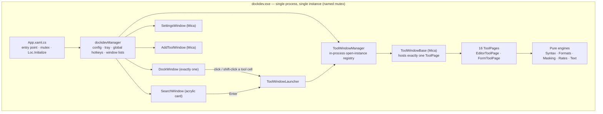

# dockdev — Project Design Document

**A developer-tools floating dock for Windows 11. Click a tool, get a temporary window that does
the job offline, close it, move on.**

> **Status:** **v2.1** — the shell and the catalog are implemented; this document is the standing
> reference for why each piece is shaped the way it is.

---

## Table of contents

1. [Executive summary](#1-executive-summary)
2. [What changed from v1.0](#2-what-changed-from-v10)
3. [Goals, non-goals & assumptions](#3-goals-non-goals--assumptions)
4. [Personas & core scenarios](#4-personas--core-scenarios)
5. [High-level architecture](#5-high-level-architecture)
6. [Tech stack](#6-tech-stack)
7. [Repository & solution layout](#7-repository--solution-layout)
8. [Domain model](#8-domain-model)
9. [The tool framework](#9-the-tool-framework)
10. [Span colouring — the shared highlighting engine](#10-span-colouring--the-shared-highlighting-engine)
11. [Formats & the canonical data model](#11-formats--the-canonical-data-model)
12. [The dock shell](#12-the-dock-shell)
13. [Theming & visual design system](#13-theming--visual-design-system)
14. [Tool catalog — specifications](#14-tool-catalog--specifications)
15. [Data Masker](#15-data-masker)
16. [Currency Converter](#16-currency-converter)
17. [Window & instance management](#17-window--instance-management)
18. [Discovery — dock, gallery, settings, search](#18-discovery--dock-gallery-settings-search)
19. [Persistence & config schema](#19-persistence--config-schema)
20. [Localization](#20-localization)
21. [Security & privacy](#21-security--privacy)
22. [Performance budget](#22-performance-budget)
23. [Accessibility](#23-accessibility)
24. [Testing strategy](#24-testing-strategy)
25. [Build, packaging, distribution & CI](#25-build-packaging-distribution--ci)
26. [Shell services — the deliberate absences](#26-shell-services--the-deliberate-absences)
27. [Delivery plan](#27-delivery-plan)
28. [Roadmap beyond v1](#28-roadmap-beyond-v1)
29. [Risks & open questions](#29-risks--open-questions)
30. Appendices: [A config.json](#appendix-a--configjson-example) ·
    [B syntax palette](#appendix-b--syntax-palette) ·
    [C PII rule pack](#appendix-c--v1-pii-rule-pack) ·
    [D localization keys](#appendix-d--localization-key-sample)

---

## 1. Executive summary

**dockdev** is a WinUI 3 floating dock of developer tools. The *shell* is a single strip of
Windows 11 acrylic glass that stays alive while unfocused, snaps to a screen edge with auto-hide,
magnifies under the cursor, and carries a Windows-Settings-style configuration window, full
keyboard/Narrator support and eight languages.

**A dock item is one of sixteen built-in developer tools**, and clicking it opens a **temporary,
in-process tool window** that does the work itself. Nothing launches externally. Nothing touches
the disk unless the user explicitly chooses "Save as…".

Two structural decisions follow from that and shape everything below:

- **The catalog is closed and code-defined.** There is no "add any app, file or link" concept, so
  there is no target to resolve, no shell icon to extract and no external process to watch.
- **There is exactly one dock, and its cells are flat.** No second strip to manage, no fly-out
  groups to nest — sixteen tools stay discoverable through search and the gallery (§18) instead.

The product thesis is **trustworthy scratch tools**. Every developer already has these tools — as
browser tabs on somebody else's server. Pasting a production JSON payload, a JWT, or a customer
CSV into a random website is a data-handling incident waiting to happen. dockdev is the same tools,
one click away, entirely offline, with the one networked feature (currency rates) behind explicit
consent.

Three things make sixteen tools tractable rather than sixteen times the work:

| Lever | Effect |
|---|---|
| **Two page archetypes** (§9) | Eleven editor-shaped tools and five form-shaped tools share two layouts, not sixteen |
| **One span-colouring primitive** (§10) | Syntax highlighting, regex matches, PII findings and diff changes are all "colour these ranges" — one control serves all four |
| **One format interface** (§11) | JSON, XML and CSV each implement `IDataFormat` once and light up the formatter, the converter and the masker |

---

## 2. What changed from v1.0

v1.0 designed four tools: JSON Editor, XML Editor, Data Converter, Base64. Six things changed.

| # | Change | Why |
|---|---|---|
| 1 | **Syntax colouring added** (§10) | v1.0 never mentioned colour. It is now a headline requirement, and WinUI ships no code editor, so this is the largest new subsystem |
| 2 | **Data Masker added** (§15) | New requirement: detect PII by key or by value and mask it. The most substantial new tool |
| 3 | **Currency Converter added** (§16) | New requirement, and the only one needing the network — gated behind `NetworkPolicy` (§21) so "zero network calls by default" stays literally true |
| 4 | **Catalog grew 4 → 16** (§14) | Ten further tools, each costed. Forces the discovery redesign in §18 |
| 5 | **Tools are `ToolPage`, not `Window`** (§9) | v1.0 put content directly in `Window` subclasses, which permanently blocks the tabbed-host idea. One indirection now, no rewrite later |
| 6 | **`DataNode` replaces the flat tabular intermediate** (§11) | v1.0 converted everything through a list of dictionaries, which is lossy for *every* conversion. A recursive node keeps JSON⇄XML lossless and confines lossiness to the CSV leg where it is inherent |

Decisions taken since v1.0, with alternatives rejected:

| Decision | Chosen | Rejected |
|---|---|---|
| Colour engine | Native tokenizer + virtualized `CodeView` | WebView2 + Monaco (~40 MB of bundled assets; the Evergreen Runtime ships with Windows 11 but is **not** guaranteed on the Windows 10 floor; ~300 ms per window open; a browser process per open tool window) |
| Currency rates | Opt-in ECB daily reference XML + offline cache | Always-on fetch; keyed commercial API; dropping the tool |

---

## 3. Goals, non-goals & assumptions

### Goals

- **A shell that feels native.** Placement, snapping, auto-hide, magnification, the tray icon, the
  global hotkey and full keyboard/Narrator support behave the way a Windows 11 shell surface should.
- **One coherent visual system.** One acrylic recipe for the dock, Mica for every window with a
  title bar, explicit Light/Dark/System/High-Contrast rules, the Fluent type ramp and 4-DIP spacing.
- **Colour everywhere it helps.** Formatted output, regex matches, PII findings and diffs are all
  syntax-coloured, theme-aware and contrast-verified.
- **Temporary by default.** Every invocation is a disposable in-memory scratch window.
- **Offline by default.** Zero network calls out of the box. Two opt-in exceptions, both revocable.
- **Extensible.** Tool #17 is one `ToolPage` plus one catalog entry. Format #4 is one `IDataFormat`
  with no UI work at all.

### Non-goals (v1)

- No session restore or autosave of tool content across restarts.
- No cloud sync, accounts, or multi-device settings.
- No third-party plugin SDK — the catalog is closed and code-defined.
- No folder fly-outs / stacks (tied to a file-system concept dockdev does not have).
- No arbitrary "add any app/file/link" flow — the Add window is a fixed tool gallery.
- **No groups.** A fly-out cell holding several tools buys nothing when the whole catalog is
  sixteen entries and search is one keystroke away; it costs a second layout, a second drop target
  and a second reorder model.
- **No second dock.** One strip, movable between monitors from Settings ▸ Dock. Several strips
  would multiply every placement, hotkey and item-ownership question for a catalog this small.
- No ML/NER-based PII detection (§15 explains the reasoning).
- No YAML, no Markdown preview, no QR codes — each needs a dependency; all are roadmap items.

### Assumptions

| # | Assumption | Alternative if wrong |
|---|---|---|
| 1 | Name **dockdev**, new repo, MIT license | Find-and-replace before scaffolding |
| 2 | Click always opens a **new** temporary window; a Settings switch restores taskbar-style focus-the-existing-one behaviour | Ship reuse-by-default instead |
| 3 | Input panes stay plain text; colour is on the **output** | Revisit with Monaco if live coloured editing proves essential |
| 4 | No content persistence between restarts; a dirty-check guards close | Add session restore in v1.1 |
| 5 | Portable unpackaged exe by default, optional MSIX | — |
| 6 | English only at v1, with key-parity scaffolding for the other seven languages | Block launch on eight translations |

---

## 4. Personas & core scenarios

**Priya, full-stack developer.** Several times an hour she eyeballs a JSON response, checks some
XML, flips a JWT payload out of Base64, or converts a CSV export to a JSON fixture. Today that
means a browser tab on a third-party site — a clipboard round-trip through somebody she does not
control. She wants those tools offline, instant, and docked where her launcher already lives.

**Sam, support engineer.** Attaches customer payloads to bug tickets. Needs the PII gone before it
leaves their laptop, needs the structure intact so the ticket is still useful, and needs the same
customer id to mask to the same token in every file so the records still join up.

Core scenarios — all should feel instant: click, paste, read, close.

1. Paste a minified JSON response → **Format** → skim the coloured tree → close. Nothing saved.
2. Drag `payload.json` onto the JSON dock icon → it opens already loaded and formatted.
3. Copy a Base64 blob from a debugger → open Base64 → **Paste clipboard** chip → **Decode** → it is
   a PNG → inline preview.
4. Paste a customer record into **Data Masker** → review 7 findings → switch two of them from
   *Redact* to *Tokenize* → copy the masked output into a ticket.
5. Keep three JSON windows open side by side comparing three payload versions.
6. Paste two config files into **Text Diff** → see the three lines that actually differ.

---

## 5. High-level architecture



**Ownership:** one manager owns everything app-wide (config file, tray icon, global hotkeys,
Settings/Add/Search windows) and creates the single `DockWindow`, which knows only about its own
strip. `ToolWindowManager` owns the one genuinely new singleton — the map of which tools currently
have open scratch windows.

**The layering rule that keeps this testable:** `Services/` contains only pure, UI-free logic —
tokenizers, formatters, the masking engine, rate maths, diff. `Controls/` and `ToolPages/` contain
only presentation. No service references a XAML type. Every algorithm in this app is therefore
unit-testable with no desktop, which is what makes a sixteen-tool catalog maintainable.

---

## 6. Tech stack

| Layer | Choice | Notes |
|---|---|---|
| UI framework | **WinUI 3** via **Windows App SDK 1.8.x** | The only framework that gives native acrylic, Mica and Fluent controls without a web runtime |
| Language / runtime | **C# 13, .NET 10**, nullable + implicit usings | `net10.0-windows10.0.26100.0`, `TargetPlatformMinVersion=10.0.17763.0` |
| Architectures | `x64` + `ARM64` | `Platform`→RID normalization in `dockdev.csproj`: `-p:Platform=ARM64` builds natively for Windows-on-ARM |
| Packaging | Unpackaged self-contained portable `.exe`; optional MSIX via `-p:StorePackage=true` | Portable by default; the Store build is the same code with an identity |
| Windowing / interop | `AppWindow` + DWM P/Invoke for rounded corners, border colour, immersive dark mode | Confined to `WindowChrome.cs` and `NativeMethods.cs` |
| JSON | `System.Text.Json` — `Utf8JsonReader`, `JsonDocument` | Config persistence *and* the JSON engine |
| XML | `System.Xml.Linq` + `XmlReader`, XXE-hardened | §21 |
| CSV | Hand-rolled RFC 4180 reader/writer | Avoids a dependency for a simple format |
| Hashing | `System.Security.Cryptography` + a **hand-rolled table-driven CRC32** | `System.IO.Hashing` is a separate NuGet package; 20 lines beats a dependency |
| URL / HTML | `System.Net.WebUtility` + `System.Uri` | Both are BCL. The tool exposes `Uri.EscapeDataString` (RFC 3986) *and* `WebUtility.UrlEncode` (form encoding, space→`+`) because they differ and the difference bites people |
| HTTP | `HttpClient`, used **only** by `UpdateService` and `EcbRateProvider`, both gated | §21 |
| Testing | **xUnit** + **FlaUI** | Pure engines everywhere; a desktop only for the opt-in UI smoke run |
| CI | **GitHub Actions**, x64 + ARM64, `-warnaserror` | Plus the localization key-parity check (§20) |

**NuGet dependencies: two.** `Microsoft.WindowsAppSDK` and `Microsoft.Windows.SDK.BuildTools`.
Notably absent is `System.Drawing.Common`: it is what shell-icon extraction needs, and dockdev has
no shell icons to extract (§26).

No web front end, no Electron, no cross-platform target.

---

## 7. Repository & solution layout

```
dockdev/
  dockdev.slnx
  CHANGELOG.md · LICENSE · README.md
  docs/
    dockdev-design-document.md          (this file)
    design-guidelines-review.md · privacy-policy.md
    microsoft-store-deployment.md · winget-deployment.md
  packaging/winget/manifests/
  scripts/  package-release.ps1 · run-ui-tests.ps1
  src/dockdev/
    App.xaml(.cs)                     Entry point, single-instance guard
    dockdevManager.cs                   Config · tray · hotkeys · window lists · ToolWindowManager
    DockWindow.xaml(.cs) + partials   Floating glass strip
    SearchWindow · SettingsWindow · AddToolWindow
    Controls/
      CodeEditor.xaml(.cs)            Plain monospace input + line-number gutter
      CodeView.xaml(.cs)              Virtualized colourised read-only renderer
      DiffView.xaml(.cs)              Two synchronised CodeViews + change gutter
      StructureTree.xaml(.cs)         DataNode tree with path copy
      ToolCommandBar · ToolStatusBar · FindBar · CopyButton · DropZone
      HotkeyCaptureButton.cs          Shortcut capture surface
    Models/
      ToolKind · ToolDefinition · ToolCatalog · ToolCategory · ToolDockItem
      DataNode · DockProfile · DockConfig · DockMetrics · HotkeyGesture
    Services/
      Syntax/    Token · TokenKind · ITokenizer · JsonTokenizer · XmlTokenizer ·
                 CsvTokenizer · PlainTokenizer · SpanTokens
      Formats/   IDataFormat · JsonFormat · XmlFormat · CsvFormat · FormatRegistry ·
                 CsvProjection · FormatOptions · Diagnostic
      Masking/   PiiCategory · PiiRule · PiiRuleSet · PiiDetector · Finding ·
                 MaskStrategy · Masker · MaskProfile · Validators
      Rates/     IRateProvider · EcbRateProvider · RateCache · Iso4217 · MoneyMath
      Text/      MyersDiff · CaseConvert · EscapeCodecs · LineOps
      Tools/     Base64Tools · JwtTools · HashTools · UuidTools · TimestampTools ·
                 NumberBaseTools · UrlTools · RegexRunner
      NetworkPolicy.cs · FilePickers.cs · ToolIconProvider.cs ·
      ToolWindowLauncher.cs · ToolWindowManager.cs · ToolCatalogSearch.cs
      Shell: AcrylicBackdropManager · DockStore · Loc · PackagedRuntime · MessageWindow ·
       TrayIconService · HotkeyService · StartupService · WindowChrome · UpdateService · Diag
    ToolWindows/ToolWindowBase.cs
    ToolPages/
      ToolPage.cs · EditorToolPage.cs · FormToolPage.cs
      FormatterPage · ConverterPage · Base64Page · MaskerPage · JwtPage ·
      TextToolkitPage · DiffPage · RegexPage · UrlPage ·
      HashPage · UuidPage · TimestampPage · NumberBasePage · CurrencyPage
    Themes/Syntax.xaml
    Localization/LocalizeExtension.cs · Strings/*.json
    Interop/NativeMethods.cs          (trimmed)
    Assets/dockdev.ico · Images/ · Package.appxmanifest · app.manifest · dockdev.csproj
  tests/
    dockdev.Tests/                      xUnit — every service, plus fixture corpora
    dockdev.UITests/                    FlaUI — table-driven smoke, one row per tool
  .github/workflows/ci.yml
```

---

## 8. Domain model

```csharp
namespace dockdev.Models;

/// <summary>What a dock cell represents. Every launchable value maps to exactly one built-in
/// tool page — there is no "arbitrary target" concept.</summary>
public enum ToolKind
{
    Json, DataFormatter, Xml, DataConverter, Base64, DataMasker, Jwt,
    TextToolkit, TextDiff, RegexTester, UrlEncoding,
    Hash, Uuid, Timestamp, NumberBase, Currency,
    Separator,   // a visual divider, not launchable
}

public enum ToolCategory { FormatConvert, EncodeDecode, Privacy, Text, Generate, NumbersTime }
```

```csharp
/// <summary>Static, code-defined metadata for one catalog entry — the "manifest" of a built-in
/// plugin. Adding a tool means adding one of these plus one ToolPage.</summary>
public sealed record ToolDefinition(
    ToolKind Kind,
    ToolCategory Category,
    string NameKey,                  // "Tool.Json.Name"
    string DescriptionKey,           // "Tool.Json.Desc"
    string Glyph,                    // Segoe Fluent Icons — VERIFY each before shipping
    Func<ToolPage> Factory,
    string[] FileExtensions,         // drag-and-drop routing
    string[] SearchAliases,          // "guid", "epoch", "pii" — quick-launch keywords
    bool VisibleByDefault);
```

```csharp
/// <summary>One dock entry: a tool, or a separator. Hover, magnification, cell geometry and
/// visibility live here; the resolved icon is runtime-only and never persisted.</summary>
public sealed class ToolDockItem : INotifyPropertyChanged
{
    public string Id { get; set; } = Guid.NewGuid().ToString("N");
    public ToolKind Kind { get; set; }
    public string DisplayName { get; set; } = "";     // raises PropertyChanged
    public string? CustomIconPath { get; set; }
    public string? CustomGlyph { get; set; }
    public bool Hidden { get; set; }
    public string? Hotkey { get; set; }
    // Runtime-only, never serialized: IconImage, HoverOpacity, RenderIconSize, RenderGlyphSize,
    // CellWidth/Height, SeparatorVisibility, ButtonVisibility, OpenCount, OpenIndicatorVisibility
}
```

`ToolCatalog` is the fixed, ordered, code-defined list of `ToolDefinition`s, plus
`Get(ToolKind)`, `ByCategory()`, and `BestMatchFor(filePath)` for drag-and-drop routing.

Two mechanisms in `ToolDefinition` are worth spelling out, because they are what keep sixteen tools
from becoming sixteen problems:

- **`Factory` collapses catalog entries onto shared pages.** Three catalog entries map to one page
  class, differing only by a constructor argument:

  ```csharp
  new ToolDefinition(ToolKind.Json,          …, () => new FormatterPage(FormatRegistry.Json),   …)
  new ToolDefinition(ToolKind.DataFormatter, …, () => new FormatterPage(FormatRegistry.Auto),   …)
  new ToolDefinition(ToolKind.Xml,           …, () => new FormatterPage(FormatRegistry.Xml),    …)
  ```

- **`VisibleByDefault` seeds the dock, it does not gate availability.** Six definitions set it true
  (§18); the other ten are absent from a fresh dock but fully present in the catalog, so search,
  the Add-Tool gallery and Settings ▸ Tools list all sixteen from day one. See §19 for how this
  relates to the `hidden` flag, which means something different.

`DockProfile` carries the one strip's placement (snapped, edge, free position, auto-hide,
always-on-top, transpose-when-side-snapped) and its items; `DockMetrics` and `HotkeyGesture` are
pure geometry and parsing. `DockConfig` holds that single `DockProfile` plus every app-wide setting
(§19). There are no migration fields — this is a fresh format with no predecessor.

---

## 9. The tool framework

### 9.1 Host and page are separate

v1.0 put each tool's UI directly in a `Window` subclass. That hard-codes one-tool-per-window and
makes a tabbed host a rewrite of all sixteen tools. Splitting them costs one indirection today:

```
ToolWindowBase : Window      // Mica · custom title bar · rounded corners · dirty-check ·
                             // theme propagation · registry membership · file pickers
  └── hosts exactly one ToolPage

ToolPage : UserControl       // the tool itself
```

```csharp
public abstract class ToolPage : UserControl
{
    public abstract ToolKind Kind { get; }

    /// <summary>True while the page holds content the user has not saved or copied out.
    /// Drives the close-confirmation — the whole of "temporary but not careless".</summary>
    public abstract bool IsDirty { get; }

    /// <summary>Commands surfaced in the host's command bar and bound to accelerators.</summary>
    public abstract IReadOnlyList<ToolCommand> Commands { get; }

    /// <summary>Seed the page from a dropped file or a picker.</summary>
    public virtual Task LoadFileAsync(string path) => Task.CompletedTask;

    /// <summary>Text the page would contribute to the clipboard-aware launch chip check.</summary>
    public virtual bool AcceptsClipboardText(string text) => false;

    /// <summary>Cancelled when the host window closes — every background parse ties to this.</summary>
    protected CancellationToken PageClosing { get; }
}
```

`ToolWindowBase` owns: `MicaBackdrop`, `ExtendsContentIntoTitleBar`, `WindowChrome.SetRoundedCorners`
and `HideWindowBorder` tuned to the Mica surface, theme re-application on OS theme change,
`ContentDialog`-based dirty-check on close, registration/deregistration with `ToolWindowManager`,
and the shared `FilePickers` helper.

A future `ToolHostWindow` with a `TabView` hosts N `ToolPage`s with zero tool changes.

### 9.2 Two archetypes

Sixteen bespoke layouts would be unmaintainable and would feel like sixteen different apps.

**`EditorToolPage`** — **one or two text panes**, plus an **optional auxiliary panel**, plus a
command bar and status bar. Splitters between panes; orientation follows window aspect ratio. The
two degrees of freedom cover every editor-shaped tool without any of them needing a bespoke layout:

| Tool | Panes | Auxiliary panel |
|---|---|---|
| JSON · Data Formatter · XML | input → output | structure tree |
| Data Converter · Base64 · URL & Encoding · Text Toolkit | input → output | — |
| JWT | input → output (three decoded sections) | claims table |
| Data Masker | input → output | findings list |
| Regex Tester | pattern + subject → replacement preview | groups table |
| Text Diff | **two inputs**, rendered by `DiffView` | change list |

**`FormToolPage`** — a vertical stack of labelled input rows and result rows, each result with its
own copy button and a "copied" confirmation.

> Used by: Hash & HMAC · UUID · Timestamp · Number Base · Currency.

### 9.3 Shared command contract

Muscle memory must transfer between tools, so commands are declared, not hand-placed:

| Command | Accelerator | Present in |
|---|---|---|
| Primary action (Format / Convert / Decode / Mask / …) | `Ctrl+Enter` | All |
| Copy output | `Ctrl+Shift+C` | All |
| Open file… | `Ctrl+O` | All editor-shaped |
| Save as… | `Ctrl+S` | All editor-shaped |
| Clear | `Ctrl+Shift+X` | All |
| Find | `Ctrl+F` | All editor-shaped |
| Validate | `Ctrl+Shift+V` | JSON · XML · Data Formatter · Converter |
| Minify | — | JSON · XML · Data Formatter |
| Word wrap | — | All editor-shaped |
| Swap input/output | `Ctrl+Shift+S` | Converter · Base64 · URL |

**Status bar contract:** character/byte count · a validation chip (`Valid` / `Error at line X,
col Y` / untouched) · the structural path of the current selection where meaningful. The chip is an
`AutomationProperties.LiveSetting` live region so Narrator announces validation changes.

### 9.4 Off-thread compute

Anything above a small input threshold runs on `Task.Run` with a `CancellationToken` tied to
`PageClosing`. A huge paste never freezes the window, and closing mid-parse actually stops the work.
This is a rule, not a nicety — see §22 for the thresholds.

---

## 10. Span colouring — the shared highlighting engine

**The insight that makes sixteen tools affordable:** a token stream is not syntax-specific. It is
"colour these ranges of this text". Four separate features need exactly that.

| Feature | Token source | Kinds used |
|---|---|---|
| Syntax highlighting | per-format tokenizer | `PropertyName`, `String`, `Number`, … |
| Regex Tester | match + group spans | `Match`, `Group` |
| Data Masker | PII findings and masked spans | `Finding`, `Masked` |
| Text Diff | word-level change spans | `Added`, `Removed` |

One control, one theming pass, one virtualization implementation, one accessibility pass.

### 10.1 The model

```csharp
public readonly record struct Token(int Start, int Length, TokenKind Kind);

public enum TokenKind
{
    Plain, Punctuation, PropertyName, String, Number, Boolean, Null, Comment,
    TagName, AttributeName, AttributeValue, CData, Keyword, Error,   // syntax
    Match, Group,                                                     // regex
    Finding, Masked,                                                  // masker
    Added, Removed,                                                   // diff
}

public interface ITokenizer
{
    /// <summary>Tokenize the whole document.</summary>
    IReadOnlyList<Token> Tokenize(string text);

    /// <summary>Tokenize only lines [first, last), resuming from the scanner state saved at
    /// <paramref name="first"/>. This is what makes §22's "visible lines only" tier possible.</summary>
    IReadOnlyList<Token> TokenizeRange(string text, LineIndex lines, int first, int last,
                                       ScannerState entryState);

    /// <summary>The scanner state at the end of a line, so the next range can resume mid-construct.
    /// A value type — one small struct per line, not a parse tree.</summary>
    ScannerState StateAfter(string text, LineIndex lines, int line, ScannerState entryState);
}
```

Tokenizers are hand-written single-pass scanners — no regex on hot paths, no allocation per
character. They are pure functions of a string, so they are 100% unit-testable with no UI.

**Property test every tokenizer must pass:** concatenating every token's span in order, plus the
gaps between them, must reconstruct the input **byte for byte**. This one test catches the entire
class of off-by-one bugs that make a highlighter drop or duplicate characters.

### 10.2 The controls

**`CodeView`** — read-only, virtualized, colourised.

- Line-based `ItemsRepeater` inside a `ScrollViewer`. Only visible lines materialise their `Run`s;
  a recycled line template keeps the live visual tree proportional to the viewport, not the
  document. A 1 MB JSON is ~100k tokens and *will* hang a single `RichTextBlock` — virtualization
  is mandatory, not an optimization.
- Line numbers, gutter (diff markers, error squiggles, finding badges), current-line highlight.
- **Honest trade-off:** per-line blocks mean no free-form cross-line drag-select. Mitigated three
  ways — `Copy output` copies the whole buffer, each line has a copy affordance, and a
  **plain-text view toggle** swaps in a single selectable `TextBox` when someone needs to select
  an arbitrary region.

**`CodeEditor`** — the input side. A plain monospace `TextBox` with a line-number gutter and
tab/indent handling. Input is deliberately *not* coloured: re-highlighting an editable control on
every keystroke is the classic WinUI performance trap, and the workflow here is paste → format →
read → close, where colour belongs on the output.

**`DiffView`** — two synchronised `CodeView`s sharing a scroll offset, with a change gutter.

Re-tokenization is debounced 150 ms after typing stops, runs off-thread, and is cancelled by
`PageClosing`.

### 10.3 Colour rules

Defined in `Themes/Syntax.xaml` as three brush sets (Light / Dark / High Contrast), referenced as
`{ThemeResource}` and never hardcoded. Requirements:

- Every token colour clears **4.5:1** against its surface in both Light and Dark (WCAG AA for body
  text). Verified as a checklist item, not assumed.
- Under High Contrast, the palette collapses to system colours, matching the backdrop suppression
  in §13.3.
- Colour is never the only signal: errors also get a squiggle and a status-bar message, diff lines
  also get `+`/`−` gutter marks, findings also get a badge. This is a hard requirement for
  colour-blind users, not a nicety.

The palette is in [Appendix B](#appendix-b--syntax-palette).

### 10.4 Incremental tokenization

`CodeView` renders only visible lines, so it must be able to tokenize only visible lines — but a
multi-line construct (a block comment, a CDATA section, a string with escaped newlines) means line
*N* cannot be scanned correctly without knowing how line *N−1* ended. Two structures solve this:

- **`LineIndex`** — the character offset of every line start, built in one O(n) pass and cached.
  Cheap even for a 50 MB document (an `int[]`), and it is also what maps a caret position to a
  line/column for the status bar and error banners.
- **`ScannerState`** — a small value type (usually one enum plus a nesting depth) recording what the
  scanner was inside at the end of a line. One entry per line, stored in a parallel array.

Scrolling to line 40,000 therefore costs "resume from the state saved at line 40,000 and scan the
~50 visible lines", not "re-scan 40,000 lines". An edit invalidates saved state only from the edited
line forward, and only until the state converges back to a previously recorded value — which for
JSON is almost always within a line or two.

For documents below the §22 small-input threshold, the whole-document `Tokenize` path is used and
none of this machinery runs. It exists for the middle tier.

---

## 11. Formats & the canonical data model

### 11.1 `IDataFormat`

```csharp
public interface IDataFormat
{
    string Id { get; }                                    // "json", "xml", "csv"
    string DisplayNameKey { get; }
    string[] Extensions { get; }

    /// <summary>0–100. Drives Auto mode; the user can always override.</summary>
    int DetectConfidence(ReadOnlySpan<char> text);

    /// <summary>The format's scanner, exposing both the whole-document and the incremental
    /// line-range paths from §10.</summary>
    ITokenizer Tokenizer { get; }

    FormatResult Format(string text, FormatOptions options);
    FormatResult Minify(string text);
    IReadOnlyList<Diagnostic> Validate(string text);      // line, column, message

    DataNode ToCanonical(string text);
    string FromCanonical(DataNode node, FormatOptions options);
}
```

`FormatRegistry` holds the implementations and does auto-detection by taking the highest
confidence. v1 ships `JsonFormat`, `XmlFormat`, `CsvFormat`. **YAML, SQL, TOML and HTML are each
one class with zero UI work** — that is the payoff for this interface existing.

Consequence: the JSON tool, the Data Formatter and the XML tool are the *same page* with different
presets. v1.0's separate `JsonEditorWindow` and `XmlEditorWindow` are gone.

### 11.2 `DataNode`

v1.0 converted through `IReadOnlyList<IReadOnlyDictionary<string, object?>>` — a flat table, which
flattens **every** conversion including JSON→XML where nothing needs flattening. A recursive node
fixes that:

```csharp
public abstract record DataNode;
public sealed record ObjectNode(IReadOnlyList<(string Key, DataNode Value)> Members) : DataNode;
public sealed record ArrayNode(IReadOnlyList<DataNode> Items) : DataNode;
public sealed record ScalarNode(string? Raw, ScalarKind Kind) : DataNode;  // String/Number/Bool/Null

public enum ScalarKind { String, Number, Boolean, Null }
```

- `ObjectNode` keeps members as an **ordered list, not a dictionary** — JSON permits duplicate keys
  and XML routinely has repeated sibling elements; a dictionary would silently drop data.
- `ScalarNode` keeps the **raw lexeme** rather than a parsed `double`, so a 20-digit id or a
  high-precision decimal round-trips exactly instead of being mangled by float conversion. This is
  the single most common data-corruption bug in JSON tools.

**Lossiness is confined to CSV**, where it is inherent. `CsvProjection.Flatten(DataNode)` emits
dotted keys (`address.city`) and `CsvProjection.Rebuild(rows)` reverses it. One tested place, one
in-product info tip explaining it. XML attributes map to `@name` members, text content to `#text`,
so XML→JSON→XML also round-trips.

`DataNode` is also what the Data Masker walks (§15) and what `StructureTree` renders.

---

## 12. The dock shell

One borderless glass strip, built from a handful of pieces that every other surface reuses:

- `DockGlassButtonStyle` — the rounded, theme-aware hover/press chrome (`SubtleFillColorSecondary`
  on hover, `SubtleFillColorTertiary` on press) on every cell, the gear, and the empty-state pill.
- An `ItemsRepeater` + `StackLayout` cell template — icon-or-glyph, open-window indicator dot,
  separator hairline — with the dot's meaning ("this tool has an open window") carried to assistive
  technology through `AutomationProperties.ItemStatus`.
- Analytic sizing from `CellExtent`; a reorder drag measured against the *other* items so the
  insertion point cannot oscillate; a master-vs-visible item projection so a hidden item keeps its
  place in the order; snap-to-edge and auto-hide with a peek notch; cursor-follow magnification;
  per-item hotkey capture; full keyboard support.

The strip is deliberately flat: every cell either launches a tool or is a separator. There is no
container cell and no second dock, so there is exactly one list to reorder, one drop target model
and one place an item can live.

**Drag-and-drop** — `DockWindow.DropTargets.cs`:

1. **Dropped on a tool cell** → open a new instance preloaded with that file, if the tool's
   `FileExtensions` accepts it; otherwise a short inline "that tool can't open .xyz" tooltip rather
   than silently doing the wrong thing.
2. **Dropped on empty dock space** → `ToolCatalog.BestMatchFor(file)`; with no match, a short
   inline explanation rather than a silent no-op.

Every drop path enforces the §22 size ceiling *before* reading the file.

---

## 13. Theming & visual design system

### 13.1 Acrylic glass (the dock)

`AcrylicBackdropManager` owns the recipe, and it is exact:

| Theme | Tint | Tint opacity | Luminosity opacity | Fallback |
|---|---|---|---|---|
| Dark (default) | `#1C1C1C` | 0.55 | 0.90 | `#2C2C2C` |
| Light | `#F2F2F2` | 0.55 | 0.90 | `#F3F3F3` |

`DesktopAcrylicController` with `SystemBackdropConfiguration.IsInputActive` forced true (the dock is
never foreground; without this WinUI collapses the glass to flat fallback the moment it loses
focus), `Kind = DesktopAcrylicKind.Base`. Frostiness slider → `LuminosityOpacity` clamped 0.3–1.0,
default 1.00. Accent-tint switch blends the Windows accent into the tint (55% toward black in Dark,
60% toward white in Light). The DWM rim is painted to match the glass's own effective tint.

### 13.2 Mica (dialogs and every tool window)

`SettingsWindow`, `AddToolWindow` and **every `ToolWindowBase`** use `MicaBackdrop` with the custom
title bar extended into content. The rule is one line: **glass = the dock, Mica = anything with
content and a title bar.**

Mica requires Windows 11. On the supported Windows 10 floor (1809), `MicaBackdrop` is unavailable
and tool windows fall back to an opaque `SolidBackgroundFillColorBaseBrush` — the same substitution
High Contrast triggers (§13.3), so it is one code path, not two.

### 13.3 Theme resolution

```csharp
internal static ElementTheme ResolveTheme(DockTheme theme)
{
    if (IsHighContrast()) return ElementTheme.Default;   // High Contrast always wins
    return theme switch
    {
        DockTheme.Light  => ElementTheme.Light,
        DockTheme.System => ElementTheme.Default,
        _                => ElementTheme.Dark,           // default: matches the Win11 dark taskbar
    };
}
```

Every window — dock, Settings, Add-Tool, Search, and every open tool window — sets its root's
`RequestedTheme` from this one function, so a theme change recolours everything in one pass,
including the syntax palette in every open `CodeView`. Under High Contrast the acrylic and Mica
backdrops are suppressed and an opaque `SolidBackgroundFillColorBaseBrush` is painted instead.

### 13.4 Window chrome

`WindowChrome.cs` drives both families:

- **Dock:** `MakeBorderlessToolWindow` + `StripFrame` + `SetRoundedCorners` +
  `SetWindowBorderColor` tuned to the glass tint.
- **Tool windows:** a normal `OverlappedPresenter` — resizable, minimizable, maximizable, with a
  taskbar entry, because a user genuinely wants to Alt-Tab to a scratch JSON window — plus
  `SetRoundedCorners`, `HideWindowBorder` (`#F3F3F3` light / `#202020` dark) and `SetTitleBarTheme`
  so caption buttons are correct from the first frame.

### 13.5 Typography, iconography, spacing

- **Type ramp only:** `TitleTextBlockStyle`, `BodyStrongTextBlockStyle`, `CaptionTextBlockStyle`.
  No ad-hoc `FontSize`/`FontWeight` anywhere.
- **Monospace:** `Cascadia Mono` with a `Consolas` fallback, exposed as one `ThemeResource` so every
  code surface agrees.
- **Iconography:** Segoe Fluent Icons via `SymbolThemeFontFamily`, glyphs as `\uXXXX` escapes, never
  raw literals. **Every tool glyph is a placeholder until verified against the Segoe
  Fluent Icons list** — sixteen unverified glyph codes is sixteen chances to ship a tofu box.
- **Spacing:** every surface derives its geometry from `DockMetrics`.

  | Density | Cell | Icon | Glyph | Separator | Divider | Indicator | Corner |
  |---|---|---|---|---|---|---|---|
  | Small | 32 | 20 | 15 | 11 | 18 | 10 | 6 |
  | **Medium (default)** | **40** | **24** | **18** | **13** | **24** | **12** | **8** |
  | Large | 52 | 32 | 24 | 16 | 32 | 16 | 10 |

  Medium matches the Windows 11 taskbar. Magnification constants: `MagnifyPeak=1.55`,
  `MagnifyReach=0.5`, `MagnifyHold=0.25`, cosine easing.

### 13.6 Motion

Auto-hide's slide and the magnify swell honour the OS reduced-motion setting, snapping to the end
state instead of animating.

---

## 14. Tool catalog — specifications

Sixteen tools. Each is scoped to "one job, offline, in memory".

### Format & Convert

**1. JSON** — `FormatterPage(json)`. Editor archetype. Input pane, colourised output, structure
tree. Format (configurable indent), Minify, Validate, sort keys, copy. Invalid JSON **never clears
the user's text**: `JsonException.LineNumber`/`BytePositionInLine` drive an inline banner and
scroll-to-position. Clicking a tree node shows its path (`$.items[2].id`) with one-click copy.
Engine: `System.Text.Json` only.

**2. Data Formatter** — `FormatterPage(auto)`. Same page, format auto-detected from content with a
manual override always visible. This is the "beautify anything" entry point.

**3. XML** — `FormatterPage(xml)`. **Not seeded onto the dock** (it costs nothing — it is a preset —
but the Data Formatter already covers XML for most people, and dock space is the scarce resource).
Format, Minify, Validate well-formedness. Engine: `XDocument`/`XmlReader` with DTD processing and
external entity resolution disabled (§21 — a security requirement, not optional hardening).

**4. Data Converter** — `ConverterPage`. Source format · ⇄ swap · target format · input · read-only
output. Conversions route through `DataNode` (§11.2), so JSON⇄XML is lossless and only the CSV leg
flattens, with an in-product info tip saying so.

### Encode & Decode

**5. Base64** — Encode/Decode toggle; multiline input or "Choose file…"; options for URL-safe
alphabet, MIME 76-char wrapping, and strict-vs-lenient input. After a successful decode, magic-byte
sniffing (PNG/JPEG/GIF/BMP/WEBP) renders an inline preview — with the decoded size checked
**before** handing bytes to the image decoder. Invalid Base64 produces a clear inline message,
never a silent truncation.

**6. URL & Encoding** — three sections in one page: URL encode/decode exposing **both**
`Uri.EscapeDataString` (RFC 3986) and `WebUtility.UrlEncode` (form encoding, space→`+`) because the
difference matters and trips people up; HTML entity encode/decode; and a **URL parser** breaking a
URL into scheme/host/port/path/query/fragment with the query as an editable parameter table that
rebuilds the URL as you edit.

**7. JWT Decoder** — splits header/payload/signature, Base64url-decodes the first two, and renders
them as colourised JSON. Humanises `exp`/`iat`/`nbf` with a live "expired 3 hours ago" chip. Warns
on `alg: none` and on `alg` values that do not match the `typ`. **Explicitly does not verify
signatures** and says so in the UI — a tool that shows a green tick next to an unverified token is
worse than no tool.

**8. Hash & HMAC** — Form archetype. MD5, SHA-1, SHA-256, SHA-384, SHA-512 and CRC32 computed
simultaneously over text or a chosen file, each with a copy button. HMAC mode takes a key. A
"compare to expected" box shows a match/no-match chip using a **constant-time comparison**. MD5 and
SHA-1 are labelled *checksum only — not secure* in the UI.

### Privacy

**9. Data Masker** — see §15.

### Text

**10. Text Toolkit** — one page, operation picker: case conversion (camel, Pascal, snake, kebab,
CONSTANT, Title, sentence), slugify, sort lines (with natural and numeric sort), dedupe, trim,
number lines, reverse, join/split, count characters/words/lines, and escape/unescape for JSON
strings, C#, SQL, shell and regex. Operations chain — the output pane is the input to the next
operation with one click.

**11. Text Diff** — `DiffView`. Myers diff at line level, refined to word level within changed
lines. Options: ignore whitespace, ignore case, ignore blank lines. Change gutter with `+`/`−`
marks and a change counter; navigate changes with F8/Shift+F8.

**12. Regex Tester** — .NET flavour. Pattern box with an options row (IgnoreCase, Multiline,
Singleline, IgnorePatternWhitespace, ECMAScript), subject text rendered in a `CodeView` with match
spans coloured via `Match`/`Group` tokens, a groups table (index, name, value, position), and a
replacement preview. **Every `Regex` is constructed with a `MatchTimeout` and evaluated off-thread**
— a regex tester is the one place in the app where the user can trivially write a catastrophic
backtracking pattern, and it must degrade to "pattern timed out" rather than hang.

### Generate

**13. UUID Generator** — Form archetype. v4 (`Guid.NewGuid`) and **v7** (`Guid.CreateVersion7`,
time-ordered — increasingly the right default for database keys), plus NIL. Bulk generate N.
Formats: hyphenated, braced, parenthesised, `N` compact, uppercase, Base64. Copy all.

### Numbers & Time

**14. Timestamp Converter** — Form archetype. Epoch seconds/milliseconds/microseconds ⇄ ISO 8601 ⇄
RFC 1123 ⇄ local/UTC/named timezone (`TimeZoneInfo`), a live "now" row, and a relative rendering
("3 days ago"). Auto-detects which unit a pasted number is by magnitude, with an override.

**15. Number Base** — Form archetype. Decimal, hex, binary, octal, all live-linked so editing any
one updates the rest. Width selector (8/16/32/64-bit), signed/unsigned, and a bitwise playground
(AND, OR, XOR, NOT, shifts) with a clickable bit grid.

**16. Currency Converter** — see §16.

---

## 15. Data Masker

*"Identify PII in the data (by value or by key) and auto-mask it"* — correctly flagged as the hard
one. The honest design is **a deterministic rule engine plus a mandatory human-review pane**, not a
model.

**Why not ML/NER:** person names and street addresses cannot be detected by value with regex, and
detecting them properly means bundling an ONNX NER model — 50–200 MB, a large accuracy debate, and
per-window inference latency, in an app whose whole promise is instant windows. v1 therefore
detects names and addresses **by key only** (`name`, `firstName`, `address`, `street`) and says so
plainly in the UI. Pretending otherwise would be the worst outcome: a tool that quietly misses PII
is more dangerous than no tool, because people trust it.

### 15.1 Detection

```csharp
public sealed record PiiRule(
    string Id,
    PiiCategory Category,
    Regex? KeyPattern,                  // field name / JSON path segment / CSV header
    Regex? ValuePattern,
    Func<string, bool>? Validator,      // Luhn, Verhoeff, IBAN mod-97, JWT shape
    Confidence BaseConfidence,
    MaskStrategy DefaultStrategy,
    string? Locale);                    // "in", "us", "gb", null = global

public sealed record Finding(
    string RuleId, PiiCategory Category, string Path,
    int Start, int Length, Confidence Confidence,
    MaskStrategy Strategy, bool Included);

public enum Confidence { Low, Medium, High }
```

Every `Regex` in a rule is constructed with an explicit `MatchTimeout` (§21). The rule pack is data,
so a malformed user-authored rule must degrade to "this rule timed out, skipped" — never to a hung
window.

Confidence scoring:

| Signal | Confidence |
|---|---|
| Key matches **and** value matches | High |
| Value matches **and** a checksum validator passes (Luhn, Verhoeff, mod-97) | High |
| Value matches, no validator available | Medium |
| Key matches only | Medium |
| Ambiguous shape only (bare 10-digit number, lone GUID) | Low — **off by default** |

A threshold slider decides what is masked automatically; everything detected is always listed.

**Structure-aware detection.** For JSON and XML the detector walks the `DataNode` tree (§11.2) and
masks **values**, leaving keys and shape intact so the output is still a useful bug report. For CSV
it classifies **per column** — sampling the header plus the first N rows — which is both faster and
far more accurate than per-cell guessing. **Sampling decides the column's classification; masking
then applies to every row in that column, not just the sampled ones.** For unstructured text it
falls back to span detection over the raw string.

The v1 rule pack — roughly 25 rules covering email, phone, payment cards, bank accounts, national
IDs, network identifiers, and developer secrets — is listed in
[Appendix C](#appendix-c--v1-pii-rule-pack).

### 15.2 Masking strategies

| Strategy | Behaviour | Use |
|---|---|---|
| `Redact` | `***` | Maximum safety |
| `PartialKeep` | Last 4 digits; domain-preserving email `j***@example.com` | Keeps the output diagnosable |
| `Hash` | SHA-256, per-session random salt by default; a user-supplied salt makes it deterministic across runs | Correlate without revealing |
| `Pseudonymize` | **Stable pseudonyms** — `EMAIL_1`, `EMAIL_2`, consistent within and across documents in a session | **Preserves referential integrity so masked data still joins.** The most useful strategy for sharing a repro, and the differentiator against every web masker. (Named `Pseudonymize`, not `Tokenize`, so it cannot be confused with §10's tokenizer) |
| `FormatPreservingFake` | A valid-shaped replacement — cards generated in test BIN ranges, RFC-valid emails | Keeps downstream validators happy |
| `Nullify` | `null` / empty | Schema-preserving removal |
| `Truncate` | First N characters | Long free-text fields |

### 15.3 UI

Three panes: **input** · **findings** · **output**.

The findings list is the heart of the tool: one row per detection showing path, category,
confidence, a truncated preview, a per-finding strategy dropdown, and an include/exclude checkbox.
Selecting a row scrolls both text panes to it. Output highlights masked spans via `Masked` tokens
(§10), so the user can see at a glance exactly what changed.

Actions: mask all / mask none · "always mask this key" (adds a key rule) · "add rule from
selection" · threshold slider · profile picker.

**Profiles** are named bundles of enabled rules and per-category strategies — `Share a bug report`
(tokenize identifiers, redact secrets), `Logs` (hash everything, keep shape), `Strict` (redact
every finding including Low confidence). Exportable as JSON so a team standardises on one rule
pack, and importable from a file.

### 15.4 Non-negotiables

- A **permanent, non-dismissible banner**: *"Best-effort detection — always review the output
  before sharing. This is not a compliance control."*
- The masker **never** writes the unmasked input to disk — `Save as…` writes the **masked output
  only**, and there is deliberately no "save original" affordance. It **never** logs content
  (`Diag` records rule ids, categories and counts only) and **never** leaves the process;
  `NetworkPolicy` denies it outright.
- Tests assert in **both directions**: recall against a positives corpus, and **zero false
  positives** against a negatives corpus — version strings must not read as IPv4, order ids must not
  read as payment cards, and a `sessionId` GUID must not be masked at the default threshold.

---

## 16. Currency Converter

The only tool that needs the network. Designed so the privacy claim in §21 survives intact.

- **Provider.** `IRateProvider`, default `EcbRateProvider`, reading the European Central Bank's
  daily reference rates
  (`https://www.ecb.europa.eu/stats/eurofxref/eurofxref-daily.xml`). Free, no API key, no account,
  ~30 currencies, published every working day and stable for two decades. It is XML, so it is parsed
  by the same hardened reader as everything else. Cross rates compute via the EUR base.
  **The ECB requires acknowledgement of the source**, so the page carries a permanent
  *"Source: European Central Bank"* line with a link — a requirement, not a courtesy.
- **Consent.** Nothing is fetched until the user opens the tool and answers a one-time card:
  *Fetch now* · *Always fetch* · *Never (manual rates)*. Mirrored by a Settings ▸ General switch and
  revocable there. With consent withheld, the tool is fully usable with hand-entered rates.
- **Cache.** `%AppData%\dockdev\rates-cache.json` with a fetch timestamp. Offline shows
  *"Rates from 2026-07-28 (offline)"* rather than an error.
- **Correctness.** `decimal` end to end, explicit rounding mode, and per-currency minor units from a
  small embedded ISO 4217 table — JPY has 0 decimal places, BHD/KWD/OMR have 3, and rendering them
  all with 2 is the classic currency bug.
- **Honesty.** Labelled *indicative mid-market rates — not for trading or accounting.* ECB rates are
  a daily reference, not a live market feed.
- **Phase 2.** A pluggable keyed provider for more currencies and crypto, with the key stored via
  DPAPI and never in `config.json`.

`docs/privacy-policy.md` is updated to say: network calls happen in exactly two situations, both
opt-in and both off by default.

---

## 17. Window & instance management

**Default:** clicking a tool cell opens a **brand-new temporary window**. This is the most literal
reading of "temporary windows for each functionality" and is genuinely useful for scratch tools —
two JSON windows side by side to compare payloads.

**Optional taskbar mode:** a Settings ▸ General switch, *"Reuse the open window for a tool"* (off
by default), gives the familiar taskbar semantics — click focuses the most recently opened window
of that tool, and **Shift+click** always forces a new instance.

```csharp
public sealed class ToolWindowManager
{
    private readonly Dictionary<ToolKind, List<ToolWindowBase>> _open = new();
    public event Action? OpenSetChanged;

    public ToolWindowBase OpenNew(ToolKind kind, string? seedFile = null);
    public bool TryFocusMostRecent(ToolKind kind);
    public int OpenCount(ToolKind kind);
}
```

The dock's open-window indicator dot reflects `OpenCount(kind) > 0`, updated on `OpenSetChanged`.
No polling at all: every state change is an in-process event, because every window is one of ours.

No hard cap on open windows in v1. Past ten windows of one kind, a gentle info tip appears rather
than silently degrading.

---

## 18. Discovery — dock, gallery, settings, search

Sixteen icons do not fit a taskbar-width strip. With a four-tool catalog this section was
cosmetic; at sixteen it is load-bearing.

**Seed dock — 6 tools:** JSON · Data Formatter · Base64 · Data Masker · Text Diff · Timestamp.
The other ten are not on a fresh dock but are fully present in the catalog, so they are reachable
from search, the gallery and Settings ▸ Tools from first launch (§19 draws the distinction between
*not on the dock* and the `hidden` flag). A tool can be taken **off the dock**; nothing can be
removed from the **catalog**, because the catalog is code-defined and fixed.

**Add-Tool window** — a **tile gallery grouped by the six categories with a search box**. Each
tile is a `ToggleButton` reflecting whether that tool is currently on the dock, so "Add" means
"customise what's visible and in what order", a simpler mental model than true add/remove. Tiles
are `88×80`, sized for translation-wrapped labels. Plus the one structural tile, **Separator**.

**Settings ▸ Tools** — one row per pinned tool, each with a show/hide switch and a remove button,
and an "Add tools" button that opens the gallery above.

**Quick-launch search is the primary discovery path.** `ToolCatalogSearch` ranks in tiers
(name-starts-with > name-contains > alias-match > description-contains) over the catalog plus
currently-open windows, so search doubles as a window switcher. Aliases matter at this catalog
size: `guid`→UUID, `epoch`/`unix`→Timestamp, `pii`/`redact`/`anonymise`→Data Masker,
`beautify`/`pretty`→Data Formatter, `jwt`/`token`→JWT, `hex`/`binary`→Number Base.

Search carries the weight that a fly-out group would otherwise have to: with the whole catalog one
keystroke away, a container cell holding four icons is a layer of structure that earns nothing.

**Per-tool global hotkeys stay opt-in per tool.** Registering sixteen system-wide hotkeys would be
hostile and would collide with everything.

---

## 19. Persistence & config schema

`DockStore` writes atomically (write temp, then move-replace — never a torn write) to
`%AppData%\dockdev\config.json`, guarded by a single-instance mutex
(`Local\dockdev.SingleInstance.v1.<sha256-of-data-dir>`).

Field notes:

- `dock.items[].kind` is the `ToolKind` string. No `target`/`arguments` fields exist.
- **`dock` is a single object, not an array.** There is one strip, so there is one profile.
- **`items` is what the dock knows about, not the catalog.** A fresh config seeds only the six
  `VisibleByDefault` tools (§8); the other ten are simply absent. Settings ▸ Tools and the Add-Tool
  gallery are projections over `ToolCatalog.All`, so all sixteen appear there regardless, and
  toggling one on appends a `ToolDockItem` to `items`. The separate `hidden` flag means something
  narrower — *on the dock but not currently rendered* — and the reorder algorithm's
  master-vs-visible projection depends on that distinction.
- No legacy or migration fields — this is a fresh format with no predecessor.
- An import is rejected unless the file actually carries a `dock` object: any JSON object
  deserializes happily into a config full of defaults, and a stray file must not silently replace
  the user's real dock with a plausible-looking empty one.
- New: `reuseToolWindows` (bool, default false) · `toolSettings` (per-tool preferences such as
  indent width and word wrap) · `maskProfiles` (array) · `network` (object with `updateCheck` and
  `currencyRates`, both false by default).
- **An unknown `kind` is skipped with a log line, never a crash** — a config written by a newer
  build must load in an older one.

See [Appendix A](#appendix-a--configjson-example).

---

## 20. Localization

`Loc.cs` and the `{loc:Localize Key=…}` markup extension are pure string-table resolution with no
domain coupling: eight embedded flat JSON dictionaries, English as the fallback for any key a
translation is missing.

- `Common.*`, `Nav.*`, `Settings.*` and `Menu.*` cover the shell.
- `Tool.*` covers the catalog: ~240 keys for sixteen tools, their commands, their validation
  messages, and the shared window chrome.
- **Ship English complete at v1**, backfilling the other seven languages afterwards. Key parity is
  enforced from day one — every language file carries the same key set, verified in CI — so closing
  the gap is mechanical rather than architectural.
- Rule for tool authors: no string concatenation for sentences. Anything with a variable uses
  `Loc.Format` with numbered placeholders, because word order differs by language.

---

## 21. Security & privacy

dockdev never calls `ShellExecute` on an arbitrary target and never makes an unrequested network
call. What it does do, constantly, is **parse untrusted structured text pasted from anywhere** —
that is the attack surface that matters here. These are design rules, not afterthoughts.

- **XXE and entity-expansion hardening.** Every `XmlReader`/`XDocument.Load` uses
  `XmlReaderSettings { DtdProcessing = DtdProcessing.Prohibit, XmlResolver = null }`. This blocks
  classic XXE (reading local files via an external entity) and billion-laughs expansion. Both are
  realistic against an app whose job is parsing XML from anywhere. **Enforced by a unit test**, not
  by convention — this is exactly the kind of setting that silently rots.
- **No code execution, ever.** Parsing goes through `System.Text.Json` and `System.Xml.Linq` POCO
  APIs only. No `eval`, no dynamic compilation, no `BinaryFormatter`, no
  `Activator.CreateInstance` from untrusted data.
- **ReDoS.** Every `Regex` in the app — the Regex Tester's user pattern *and* the masker's rule
  patterns — is constructed with an explicit `MatchTimeout` and evaluated off the UI thread.
  User-supplied patterns get a short timeout and report "pattern timed out" as a normal result.
  **Enforced by test:** `RegexTimeoutTests` reflects over every static `Regex` in the app assembly
  and over every masker rule pattern, and fails any that reports `Regex.InfiniteMatchTimeout`.
  "Every regex has a timeout" is precisely the kind of rule that holds for the twenty places
  someone was thinking about it and lapses in the twenty-first.
- **Parse-bomb and allocation guards.** The §22 size ceilings live in `Services/InputLimits.cs`,
  which is the only sanctioned way a tool reads a user-chosen file. The size is taken from the
  file's metadata *before* a byte is read, and an input past the ceiling comes back as a sentence in
  the status bar rather than an exception — the ceilings are 50 MB for text, 256 MB for a file read
  as bytes (hash/Base64: nothing tokenizes it), 16 MB for a custom icon, 8 MB for an imported
  config. Decoded Base64 is size-checked *before* being handed to an image decoder.
- **CSV injection.** A leading `=`, `+`, `-`, `@`, tab or carriage return in an exported cell can be
  executed as a formula by whatever spreadsheet opens it later — tab and CR because Excel and
  LibreOffice both strip them before evaluating what is left, so a guard checking only the four
  visible characters is a guard with a documented bypass. The CSV writer neutralises all six on
  export even though dockdev itself never executes anything.
- **Nothing from the network becomes something the shell opens.** The update check is the only part
  of dockdev that reads data it did not produce, and the only value it hands back to the user is a
  URL that goes on a `HyperlinkButton` — i.e. straight to the shell, protocol handler and all.
  `UpdateService.SafeReleaseUrl` constrains it to an `https` page on `github.com` with no user-info
  and no non-default port, and falls back to the compiled-in releases page for anything else. That
  is the security boundary of the whole feature, and it is where its tests are.
- **Least-privilege file access.** Open/Save go through WinRT `FileOpenPicker`/`FileSavePicker`
  (broker-mediated, per-file, user-consented) via the shared `FilePickers` helper — never a raw path
  and never `broadFileSystemAccess`.
- **`NetworkPolicy` is the single gate.** No component may construct an `HttpClient` directly; all
  outbound traffic goes through it, it refuses everything by default, each capability is separately
  consented and revocable, and Settings ▸ About lists which are enabled. Two capabilities exist:
  the opt-in update check and the opt-in currency rate fetch. Enforced by two tests: a behavioural
  one asserting `NetworkPolicy` denies every capability with consent withheld, and an
  **architecture test that scans the source tree for `new HttpClient(` outside `NetworkPolicy.cs`
  and fails the build if it finds one** — the rule is only real if it cannot be bypassed by
  forgetting it.
- **Clipboard on explicit action only.** Never polled, never read in the background. The
  clipboard-aware "Paste clipboard" chip (§22) checks only whether text is present and its shape —
  it does not surface content until the user clicks.
- **Secrets in memory only.** HMAC keys, hash salts and any future API key are never written to
  `config.json`; a future keyed rate provider uses DPAPI.
- **The masker never logs content** (§15.4).
- **No telemetry, no analytics, no accounts.**

---

## 22. Performance budget

v1.0 said "run big work off the UI thread". At sixteen tools that needs numbers.

| Input size | Behaviour |
|---|---|
| < 256 KB | Full tokenization, full structure tree, everything live |
| 256 KB – 5 MB | Tokenize visible lines only; tree nodes lazy-expand; debounce raised to 300 ms |
| 5 MB – 50 MB | Plain text, no tree, no live highlighting; formatting streams via `Utf8JsonReader` / `XmlReader` straight to the output buffer |
| > 50 MB | Refused with a clear, specific message — never an OOM, never a hang |

Targets: **warm window open < 150 ms** (this is why WebView2 was rejected — a browser process per
window cannot meet it); **format + colourise 1 MB JSON < 300 ms**; typing latency in the input pane
indistinguishable from a plain `TextBox`. The *first* tool window of a session will be slower while
XAML types and the Mica controller initialise; if that proves noticeable, pre-warming one hidden
host at idle is the cheap fix, but measure before adding it.

**Clipboard-aware launch.** On open, if the clipboard holds text whose shape matches the tool, show
a one-click **"Paste clipboard"** chip. Offered, never automatic — auto-pasting is a privacy
surprise and §21 forbids background clipboard reads.

---

## 23. Accessibility

Accessibility is a day-one bar to clear, not a retrofit.

- Every interactive element is a real `Button`/`ToggleButton`/`TextBox` — never a bare `Grid` with
  pointer handlers. Focus, tab order, Space/Enter invoke and focus visuals come from the platform.
- `AutomationProperties.Name` on every control. The status-bar validation chip is a live region so
  Narrator announces "Invalid JSON at line 4" without the user going to look for it.
- **`CodeView` needs deliberate automation work** — a virtualized custom renderer is exactly where
  screen-reader support gets dropped. Each line exposes its plain text to UIA; the plain-text
  toggle is the guaranteed-accessible path; and the findings list in the masker is a real
  `ListView`, so the whole tool is usable without ever reading a colour.
- **Colour is never the only signal** (§10.3): errors also squiggle and appear in the status bar,
  diff lines also carry `+`/`−` gutter marks, findings also carry a badge.
- Context menus reachable via Menu key / Shift+F10, not only right-click.
- High Contrast always overrides Light/Dark/System, on the dock and in every tool window.
- Auto-hide's slide and the magnify swell honour reduced motion.
- Tool windows are ordinary resizable taskbar-visible windows specifically so Narrator, Magnifier
  and Alt-Tab users get a completely normal window; the dock's borderless hidden-from-Alt-Tab
  treatment is deliberately not applied to them.

---

## 24. Testing strategy

The layering rule in §5 — services are pure and UI-free — is what makes this cheap. Nearly every
algorithm in a sixteen-tool app is testable with no desktop.

**`tests/dockdev.Tests` (xUnit, runs anywhere):**

| Area | Coverage |
|---|---|
| Tokenizers | Per-format cases **plus the reconstruction property test** (§10.1) for all of them |
| Formats | Golden-file format/minify output; validation line/column accuracy on malformed input |
| XML hardening | An external-entity DTD is **rejected**, not resolved; billion-laughs is refused |
| Conversion | JSON⇄XML round-trip lossless; JSON→CSV→JSON documented lossy behaviour; raw-lexeme preservation for big integers and high-precision decimals |
| Masking | Positives corpus (recall) **and** negatives corpus (zero false positives); each validator (Luhn, Verhoeff, mod-97) against known-good and known-bad vectors; tokenize stability across a document |
| Rates | Cross-rate maths, `decimal` rounding per currency minor unit, cache staleness |
| Tools | Base64 round-trips incl. URL-safe and bad padding; hashes against published vectors; UUID v7 **timestamp ordering** across generations (v7 randomises its tail, so strict monotonicity within one millisecond is not guaranteed and must not be asserted); timestamp edge cases (DST boundaries, year 2038, negative epochs before 1970, `DateTimeOffset` min/max); diff on known pairs; number-base signed/unsigned boundaries |
| Shell | `DockStore` round-trip and import rejection, `StartupService`, `PackagedRuntime`, `ToolCatalogSearch` |
| Privacy | `NetworkPolicy` refuses every call with consents withheld |
| Input limits | §22's ceilings decided from file metadata before any read; oversize refused with a message naming the ceiling; a missing/locked file reported rather than thrown |
| ReDoS | Every static `Regex` and every masker rule pattern carries a `MatchTimeout`; a catastrophic user pattern comes back as "timed out" |
| Untrusted URLs | `SafeReleaseUrl` against other schemes, look-alike hosts, suffix-match hosts, embedded credentials and odd ports |
| Packaging | `Package.appxmanifest` versions agree with the csproj and `app.manifest`; the Store's reserved revision component is 0; every logo it names exists; the startup `TaskId` matches `StartupService`; no capability beyond `runFullTrust`; the exe is `asInvoker` and per-monitor-v2 |

**`tests/dockdev.UITests` (FlaUI, opt-in, needs a real desktop):** a **table-driven** smoke test —
one row per tool: open it from the dock, paste a fixture, invoke the primary action, assert the
expected output. Plus dedicated tests for the dirty-close confirmation and for the theme switch
recolouring an open tool window. Sixteen hand-written UI tests would rot; one parameterised test
with sixteen rows does not.

Driven by `scripts/run-ui-tests.ps1`, opted into with `DOCKDEV_UITESTS`/`DOCKDEV_EXE`, pointed at a
throwaway data directory via `DOCKDEV_DATA_DIR`, and excluded from the main `.slnx`.

---

## 25. Build, packaging, distribution & CI

- **Build:** `dotnet build src/dockdev/dockdev.csproj -p:Platform=x64` (and `ARM64`).
- **Publish:** self-contained, unpackaged, portable — `WindowsAppSDKSelfContained=true`,
  `SelfContained=true`, `WindowsPackageType=None`. `EnableMsixTooling` stays on even unpackaged: it
  is what generates the resource index the compiled XAML lives in.
- **Optional MSIX:** `-p:StorePackage=true`, with `AppxSymbolPackageEnabled` defaulting false to
  avoid the `mspdbcmf.exe`/MSB6011 failure on a plain SDK install.
- **Scripts:** `package-release.ps1` (publish → zip + SHA-256 + optional Authenticode),
  `package-store.ps1` (verify the manifest → MSIX bundle → `.msixupload`), and `run-ui-tests.ps1`.
- **CI:** build x64 + ARM64 with `-warnaserror`, run unit tests, plus a **localization key-parity
  check** (§20) and the **packaging-manifest checks** (`PackageManifestTests`). The manifest is
  never compiled by an ordinary build — `StorePackage` is off by default — so without those tests
  nothing in CI would look at it until a submission was rejected for it.
- **Distribution:** portable ZIP via GitHub Releases (primary), a winget manifest, and the Store
  MSIX. See `docs/store-submission.md` for the submission checklist.
- **Package identity:** its own MSIX identity and publisher, and `runFullTrust` — which is **not**
  optional, contrary to what §29 risk 9 used to wonder. An `<Application>` with
  `EntryPoint="Windows.FullTrustApplication"` is a packaged desktop app by definition, and Windows
  refuses to deploy one that has not declared the capability; it is not a consequence of the
  DWM/Win32 chrome and dropping the chrome would not remove it. It is also the only capability
  declared, which is the part that matters at review. `PackageManifestTests` asserts both halves.

---

## 26. Shell services — the deliberate absences

A dock that launches arbitrary targets needs a lot of machinery that a closed tool catalog does
not. Naming what is *absent* is worth a section, because each absence removes a dependency, a
failure mode, or a privacy question — and because the code comments point here.

| Concern a launcher has | What dockdev does instead |
|---|---|
| Resolve an icon for an arbitrary target (shell-icon extraction, `.lnk` resolution, favicon fetch + cache) | `ToolIconProvider`: every tool's default look is a bundled Segoe Fluent glyph resolved synchronously from `ToolCatalog`. The only asynchronous work left is decoding a user-supplied image from the icon picker. This is why `System.Drawing.Common` is not a dependency and why `NativeMethods.cs` carries no `SHGetFileInfo`/`SHGetImageList`. |
| `ShellExecute` a target | `ToolWindowLauncher`: constructing an in-process `ToolPage` inside a `ToolWindowBase`. Nothing is ever handed to the shell. |
| Poll for running processes (`EnumWindows` + `GetWindowThreadProcessId`) to drive the indicator dot | `ToolWindowManager`: an in-process dictionary plus a `Closed` event. Every state change is an event we raise ourselves, so there is no poll and no lag (§17). |
| Classify what a dropped path *is* before pinning it | Nothing to classify — `ToolCatalog.BestMatchFor` routes a dropped file by extension to a tool that already exists (§12). |
| List a folder's contents into a fly-out | No folder concept, and no groups, so no fly-out bars at all. |
| Search over whatever the user pinned | `ToolCatalogSearch` searches the whole fixed catalog plus open windows, so a tool is findable whether or not it is on the dock (§18). |

**One thing worth extracting rather than repeating:** the
`WinRT.Interop.InitializeWithWindow.Initialize(picker, hwnd)` dance — required because an
unpackaged app must tell WinRT which window owns a file picker. The icon picker, the Settings
backup card and all eleven editor-shaped tools need Open/Save, so it lives once in
`Services/FilePickers.cs` rather than in fifteen copies.

---

## 27. Delivery plan

Each milestone is independently shippable. **M0–M2 alone is already a useful product** — a dock
with a colourised JSON tool.

| # | Scope | Exit criteria |
|---|---|---|
| **M0** | This document approved; scaffold `dockdev.slnx` + csproj | `dotnet build` clean |
| **M1** | Build the shell — dock, settings, tray, hotkeys, search — against a stub catalog | Snap, auto-hide, magnify and theming all correct; §13 numbers verified on a real desktop |
| **M2** | `ToolWindowBase` · `ToolPage` · both archetypes · `Token`/`CodeView`/`CodeEditor` · `ToolWindowManager` · **JSON tool** | 1 MB JSON formats and colourises in < 300 ms, virtualized; window opens < 150 ms; HC-safe |
| **M3** | `IDataFormat` registry (JSON/XML/CSV) → Data Formatter, XML, Data Converter | XXE test green; round-trip tests green |
| **M4** | Encode/decode batch: Base64 · URL & Encoding · JWT · Hash & HMAC | Unit + smoke test each |
| **M5** | Form batch: UUID · Timestamp · Number Base | Unit + smoke test each |
| **M6** | **Data Masker** | Recall and zero-false-positive targets met; review UI complete |
| **M7** | Text batch: Text Toolkit · Text Diff · Regex Tester | ReDoS timeout verified |
| **M8** | Currency Converter · `NetworkPolicy` · consent flow | Zero outbound connections with consents withheld, asserted by test |
| **M9** | Discovery: Settings ▸ Tools, Add-Tool gallery with categories + search, per-tool hotkeys, search aliases | Every tool reachable three ways |
| **M10** | Quality: EN localization + key parity in CI, accessibility pass, performance pass | Design-guidelines-style review comes back clean |
| **M11** | Ship: packaging, winget, CI, README, v1.0 tag | Release artifact from `scripts/package-release.ps1` |

**Sequencing rationale:** M2 exists to de-risk `CodeView` before eleven tools depend on it. M6 gets
its own milestone because the masker is the only tool with a research component. M8 is late because
it is the only tool that can compromise the privacy posture, and it should land when the rest is
stable enough to audit.

---

## 28. Roadmap beyond v1

- **More formats — free by construction:** YAML (`YamlDotNet`), SQL, TOML, HTML, `.env`, INI. Each
  is one `IDataFormat`, no UI work.
- **More tools:** JSON→C#/TypeScript type generator · JSONPath/XPath query · cron explainer ·
  Markdown preview (`Markdig`) · X.509/PEM decoder · test-data generator (the natural companion to
  the masker) · cURL request parser (parses only — never sends) · colour converter with a WCAG
  contrast checker · password generator · QR generator.
- **Tabbed host** — `ToolHostWindow` with a `TabView`, as a preference rather than a replacement.
  §9.1 already makes this a host change, not a tool change.
- **Session restore** — remember the last N unsaved buffers per tool.
- **NER-based masking** for names and addresses, if the size and latency cost can be justified.
- **Open plugin model** — an external tool-manifest format, once the built-in catalog pattern has
  proven itself.
- **Keyed rate providers** for more currencies and crypto.

---

## 29. Risks & open questions

| # | Risk | Mitigation |
|---|---|---|
| 1 | **`CodeView` virtualization performance** is the load-bearing assumption for eleven tools | **Spike it in M2 before** anything else depends on it. Fallback: cap live highlighting at a smaller threshold and lean harder on the plain-text path |
| 2 | **Masker false negatives create false confidence** — the most dangerous failure in the app | Permanent banner, mandatory review pane, negatives corpus in CI, and never claiming compliance |
| 3 | Names and addresses are undetectable by value in v1 | Key-only detection, stated plainly in-product; NER is a costed roadmap item |
| 4 | **Sixteen unverified Segoe Fluent glyphs** | Verify every one against the official list before implementation; do not ship a placeholder |
| 5 | ECB feed URL or schema changes | One provider class, cached last-good rates, manual entry always available |
| 6 | Sixteen tools dilute the dock | Six visible by default, search as the primary path (§18) |
| 7 | **Scope is roughly 4× v1.0** | Milestones ship independently; M0–M2 is already useful; the catalog can be cut at any milestone boundary without rework |
| 8 | The shell is bespoke code, not a framework control | It is small and well-factored, and §24 covers the parts that are pure logic |
| 9 | ~~Store capability set~~ **Settled.** `runFullTrust` is mandatory for a `Windows.FullTrustApplication`, not a consequence of the P/Invoke chrome — there is no cleaner set available, and it is the only capability declared | `PackageManifestTests` asserts `runFullTrust` is present and that nothing broader (`broadFileSystemAccess`, `location`, the library capabilities, …) ever joins it |

---

## Appendix A — `config.json` example

```json
{
  "dock": {
    "id": "9f1a2b3c4d5e6f708192a3b4c5d6e7f8",
    "items": [
      { "id": "a1", "kind": "Json", "hidden": false },
      { "id": "a2", "kind": "DataFormatter", "hidden": false },
      { "id": "a3", "kind": "Separator" },
      { "id": "a4", "kind": "Base64", "hidden": false },
      { "id": "a5", "kind": "DataMasker", "hidden": false, "hotkey": "Ctrl+Alt+M" },
      { "id": "a6", "kind": "TextDiff", "hidden": false },
      { "id": "a7", "kind": "Timestamp", "hidden": false }
    ],
    "snapped": true,
    "edge": "Bottom",
    "freeX": null,
    "freeY": null,
    "autoHide": true,
    "alwaysOnTop": true,
    "verticalWhenSideSnapped": false
  },
  "launchAtStartup": false,
  "theme": "Dark",
  "showOpenIndicators": true,
  "language": "",
  "hotkey": "Ctrl+Alt+D",
  "hotkeyEnabled": true,
  "searchHotkey": "",
  "itemHotkeysEnabled": false,
  "density": "Medium",
  "glassOpacity": 1.0,
  "accentTint": false,
  "magnify": false,
  "reuseToolWindows": false,
  "toolSettings": {
    "json": { "indent": 2, "wrap": true, "sortKeys": false },
    "masker": { "profile": "Share a bug report", "threshold": "Medium" },
    "currency": { "from": "USD", "to": "INR" }
  },
  "maskProfiles": [],
  "network": { "updateCheck": false, "currencyRates": false },
  "skippedUpdate": "",
  "seeded": true
}
```

## Appendix B — syntax palette

Indicative values; every pair is contrast-verified against its surface before shipping, and High
Contrast substitutes system colours for all of them.

| Token kind | Light | Dark | Also signalled by |
|---|---|---|---|
| `PropertyName` / `AttributeName` | `#0F5A9C` | `#79C0FF` | — |
| `String` / `AttributeValue` | `#0A6E3F` | `#7EE787` | — |
| `Number` | `#8B4A00` | `#FFA657` | — |
| `Boolean` / `Null` / `Keyword` | `#7B3FB5` | `#D2A8FF` | — |
| `TagName` | `#B02A37` | `#FF7B72` | — |
| `Comment` | `#5A6270` | `#8B949E` | italic |
| `Punctuation` | `TextFillColorSecondary` | `TextFillColorSecondary` | — |
| `Error` | `#C42B1C` | `#FF99A4` | squiggle + status bar |
| `Match` | bg `#FFF3C4` | bg `#5A4B00` | groups table |
| `Finding` | bg `#FFE0E0` | bg `#5A2020` | findings-list badge |
| `Masked` | bg `#E0E8FF` | bg `#1F3055` | findings-list badge |
| `Added` | bg `#DDF4E4` | bg `#12341F` | `+` gutter mark |
| `Removed` | bg `#FBE3E4` | bg `#3F1A1D` | `−` gutter mark |

## Appendix C — v1 PII rule pack

| Category | Rules | Validator |
|---|---|---|
| Contact | Email · phone E.164 · phone NANP · phone India | — |
| Payment | Payment card · IBAN | Luhn · mod-97 |
| National ID | US SSN · India Aadhaar · India PAN · India GSTIN · UK NINO | Verhoeff (Aadhaar) |
| Network | IPv4 · IPv6 · MAC address | — |
| Secrets | JWT · AWS access key id · AWS secret key · GitHub token · Slack token · Stripe key · PEM private-key block · connection-string password · `Authorization: Bearer` | shape checks |
| Location | Latitude/longitude pair | range check |
| Key-only | `name` · `firstName` · `lastName` · `address` · `street` · `dob` · `dateOfBirth` · `password` · `secret` · `apikey` · `token` | — |
| Low confidence (off by default) | Bare 10-digit number · lone GUID | — |

## Appendix D — localization key sample

```jsonc
{
  // Shell
  "Common.Cancel": "Cancel",
  "Common.Save": "Save",
  "Nav.General": "General",
  "Nav.Dock": "Dock",
  "Nav.Tools": "Tools",
  "Dock.Open": "Open",

  // Catalog
  "Tool.Json.Name": "JSON",
  "Tool.Json.Desc": "Format, validate and explore JSON",
  "Tool.Formatter.Name": "Data Formatter",
  "Tool.Formatter.Desc": "Beautify JSON, XML or CSV with colour and indentation",
  "Tool.Masker.Name": "Data Masker",
  "Tool.Masker.Desc": "Find and mask personal data before you share it",
  "Tool.Currency.Name": "Currency Converter",
  "Tool.Currency.Desc": "Convert amounts using European Central Bank reference rates",

  // Categories
  "Category.FormatConvert": "Format & convert",
  "Category.EncodeDecode": "Encode & decode",
  "Category.Privacy": "Privacy",

  // Shared chrome
  "Tool.DiscardTitle": "Discard unsaved changes?",
  "Tool.DiscardBody": "This scratch window hasn't been saved. Closing it will discard its content.",
  "Tool.Format": "Format",
  "Tool.CopyOutput": "Copy output",
  "Tool.PasteClipboard": "Paste clipboard",
  "Tool.InvalidAt": "Invalid at line {0}, column {1}",

  // Masker
  "Masker.Disclaimer": "Best-effort detection — always review the output before sharing. This is not a compliance control.",
  "Masker.FindingCount": "{0} items found",

  // Currency
  "Currency.ConsentTitle": "Fetch today's exchange rates?",
  "Currency.ConsentBody": "dockdev can download reference rates from the European Central Bank. No personal data is sent. You can also enter rates manually.",
  "Currency.Offline": "Rates from {0} (offline)"
}
```
